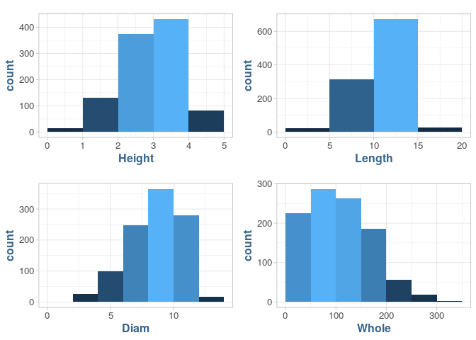
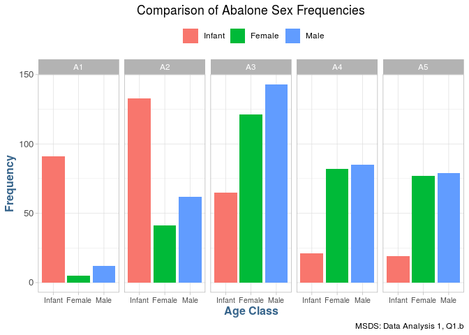
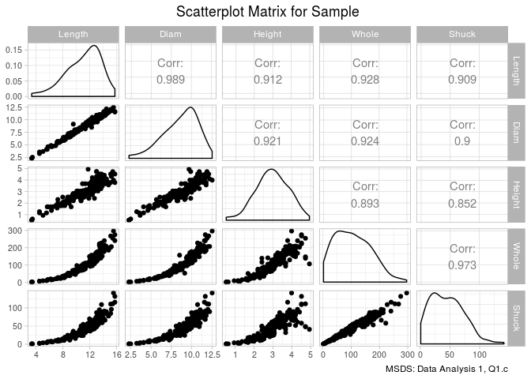
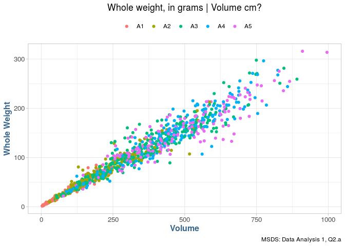
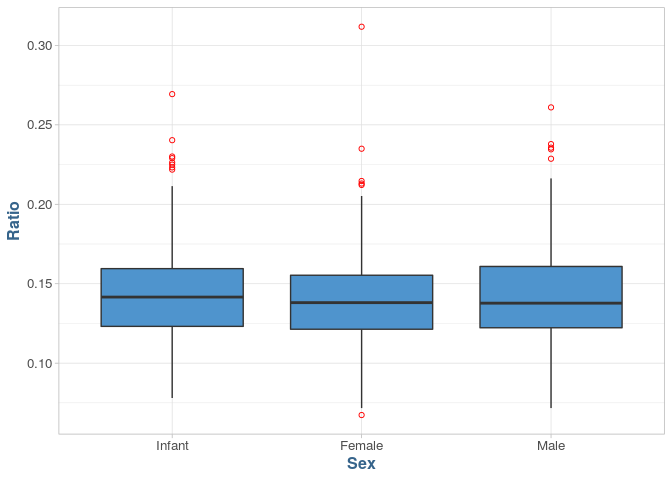
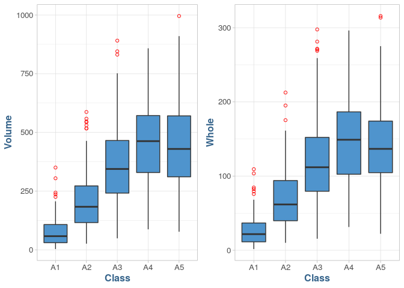
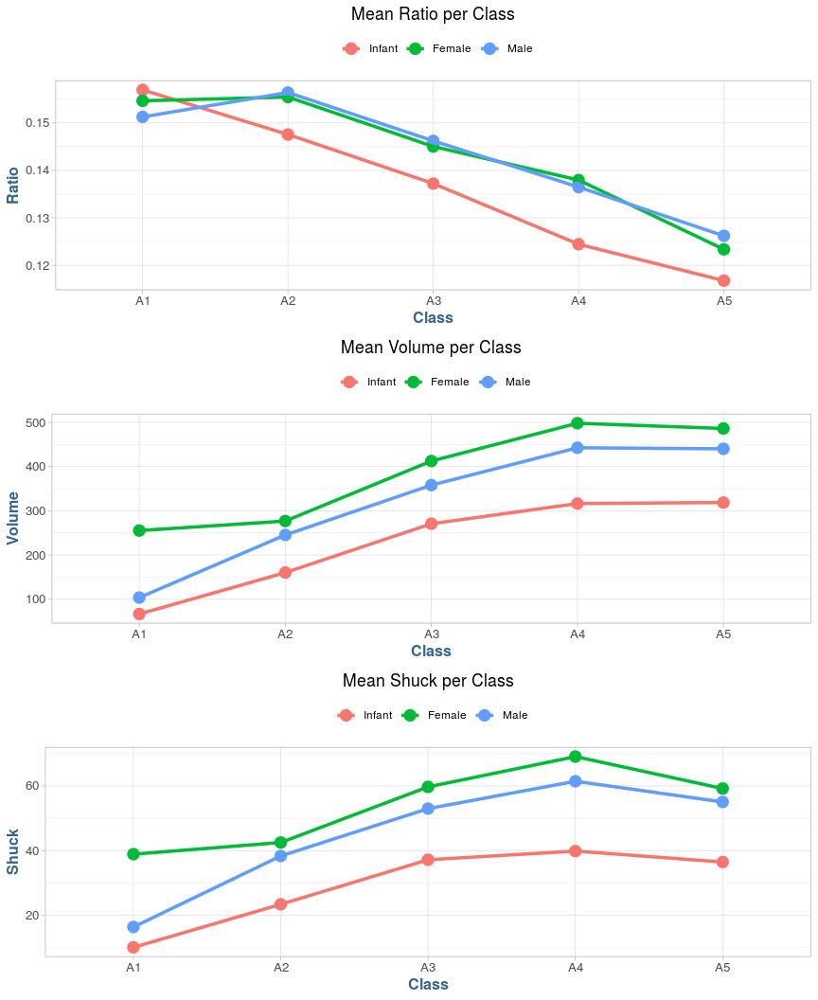

## The objective: to predict the Age of Abalone Species for harvesting

### Data Analysis

__Data analysis__ is the process of evaluating data using analytical and statistical tools to discover useful insights.


## __Abalone__

_Raw Data_

_(Preprocessing)_. Before applying machine learning algorithms.

__Preprocessing__ is the process of giving structure to our data for better understanding and decision-making related to the data. The following steps summarizes the data preprocessing pipeline:

1. __Discovering/Data Acquisition:__ Gather the data from the source and try to understand and make sense of the data.
2. __Structuring/Data Transformation:__ Since the data may come in different formats and sizes, it needs to have a consistent size and shape when merged together.
3. __Cleaning:__ This step consists of imputing null values and treating outlines/anomalies in the data to make the data ready for further analysis.
4. __Exploratory Data Analysis:__ Try to find patterns in the dataset and extract new features from the given data in order to optimize the performance of the applied machine learning model.
5. __Validating:__ This stage verifies data consistency and quality.
6. __Publishing/Modeling:__ The wrangled data is ready for processing further by the machine learning model.


```
Observations: 1,036
Variables: 8
$ Sex    <chr> "I", "I", "I", "I", "I", "I", "I", "I", "I", "I", "I", "I", "I…
$ Length <dbl> 5.565, 3.675, 10.080, 4.095, 6.930, 7.875, 6.300, 6.615, 5.250…
$ Diam   <dbl> 4.095, 2.625, 7.350, 3.150, 4.830, 6.090, 4.620, 4.935, 3.885,…
$ Height <dbl> 1.260, 0.840, 2.205, 0.945, 1.785, 2.100, 1.680, 1.575, 1.365,…
$ Whole  <dbl> 11.500000, 3.500000, 79.375000, 4.687500, 21.187500, 27.375000…
$ Shuck  <dbl> 4.3125, 1.1875, 44.0000, 2.2500, 9.8750, 11.5625, 5.9375, 7.31…
$ Rings  <int> 6, 4, 6, 3, 6, 6, 5, 6, 5, 6, 6, 5, 5, 5, 6, 5, 6, 4, 6, 5, 6,…
$ Class  <chr> "A1", "A1", "A1", "A1", "A1", "A1", "A1", "A1", "A1", "A1", "A…
```

-----

## 1.) __Dataset__

> Our base dataset contains a total of 8 variables; 5 continuous (Length, Diameter, Height, Whole and Shuck, 1 discrete variable, (Rings), and 2 categorical variables (Sex and Class)
<br/><br/>
Volume and Ratio are variables appended to our dataframe "__mydata__."
<br/><br/>
Volume is computed as Length * Diameter * Height
<br/><br/>
Ratio is computed as Shuck / Volume

1. SEX = M (male), F (female), I (infant)
2. LENGTH = Longest shell length in cm
3. DIAM = Diameter perpendicular to length in cm
4. HEIGHT = Height perpendicular to length and diameter in cm
5. WHOLE = Whole weight of abalone in grams
6. SHUCK = Shucked weight of meat in grams
7. RINGS = Age (+1.5 gives the age in years)
8. CLASS = Age classification based on RINGS (A1 = youngest,., A5 = oldest)

### a.) Summary

+ Using _summary()_ to obtain descriptive statistics of __mydata__.

<table class="table table-striped table-hover" style="margin-left: auto; margin-right: auto;">
<caption>Summary</caption>
 <thead>
  <tr>
   <th style="text-align:left;"> Variable </th>
   <th style="text-align:left;"> Min.    </th>
   <th style="text-align:left;"> 1st Qu. </th>
   <th style="text-align:left;"> Mean    </th>
   <th style="text-align:left;"> Median  </th>
   <th style="text-align:left;"> 3rd Qu. </th>
   <th style="text-align:left;"> Max.    </th>
  </tr>
 </thead>
<tbody>
  <tr>
   <td style="text-align:left;"> Diam </td>
   <td style="text-align:left;"> 1.995 </td>
   <td style="text-align:left;"> 7.350 </td>
   <td style="text-align:left;"> 8.622 </td>
   <td style="text-align:left;"> 8.925 </td>
   <td style="text-align:left;"> 10.185 </td>
   <td style="text-align:left;"> 13.230 </td>
  </tr>
  <tr>
   <td style="text-align:left;"> Height </td>
   <td style="text-align:left;"> 0.525 </td>
   <td style="text-align:left;"> 2.415 </td>
   <td style="text-align:left;"> 2.947 </td>
   <td style="text-align:left;"> 2.940 </td>
   <td style="text-align:left;"> 3.570 </td>
   <td style="text-align:left;"> 4.935 </td>
  </tr>
  <tr>
   <td style="text-align:left;"> Length </td>
   <td style="text-align:left;"> 2.73 </td>
   <td style="text-align:left;"> 9.45 </td>
   <td style="text-align:left;"> 11.08 </td>
   <td style="text-align:left;"> 11.45 </td>
   <td style="text-align:left;"> 13.02 </td>
   <td style="text-align:left;"> 16.80 </td>
  </tr>
  <tr>
   <td style="text-align:left;"> Ratio </td>
   <td style="text-align:left;"> 0.06734 </td>
   <td style="text-align:left;"> 0.12241 </td>
   <td style="text-align:left;"> 0.14205 </td>
   <td style="text-align:left;"> 0.13914 </td>
   <td style="text-align:left;"> 0.15911 </td>
   <td style="text-align:left;"> 0.31176 </td>
  </tr>
  <tr>
   <td style="text-align:left;"> Rings </td>
   <td style="text-align:left;"> 3.000 </td>
   <td style="text-align:left;"> 8.000 </td>
   <td style="text-align:left;"> 9.993 </td>
   <td style="text-align:left;"> 9.000 </td>
   <td style="text-align:left;"> 11.000 </td>
   <td style="text-align:left;"> 25.000 </td>
  </tr>
  <tr>
   <td style="text-align:left;"> Shuck </td>
   <td style="text-align:left;"> 0.5625 </td>
   <td style="text-align:left;"> 23.3006 </td>
   <td style="text-align:left;"> 45.4396 </td>
   <td style="text-align:left;"> 42.5700 </td>
   <td style="text-align:left;"> 64.2897 </td>
   <td style="text-align:left;"> 157.0800 </td>
  </tr>
  <tr>
   <td style="text-align:left;"> Volume </td>
   <td style="text-align:left;"> 3.612 </td>
   <td style="text-align:left;"> 163.545 </td>
   <td style="text-align:left;"> 326.804 </td>
   <td style="text-align:left;"> 307.363 </td>
   <td style="text-align:left;"> 463.264 </td>
   <td style="text-align:left;"> 995.673 </td>
  </tr>
  <tr>
   <td style="text-align:left;"> Whole </td>
   <td style="text-align:left;"> 1.625 </td>
   <td style="text-align:left;"> 56.484 </td>
   <td style="text-align:left;"> 105.832 </td>
   <td style="text-align:left;"> 101.344 </td>
   <td style="text-align:left;"> 150.319 </td>
   <td style="text-align:left;"> 315.750 </td>
  </tr>
</tbody>
</table>

+ Using _table()_ to present a frequency table using variables __CLASS__ and __RINGS__.

<table class="table table-striped" style="margin-left: auto; margin-right: auto;">
<caption>Frequency Table: Class ~ Rings</caption>
 <thead>
  <tr>
   <th style="text-align:left;">   </th>
   <th style="text-align:right;"> 3 </th>
   <th style="text-align:right;"> 4 </th>
   <th style="text-align:right;"> 5 </th>
   <th style="text-align:right;"> 6 </th>
   <th style="text-align:right;"> 7 </th>
   <th style="text-align:right;"> 8 </th>
   <th style="text-align:right;"> 9 </th>
   <th style="text-align:right;"> 10 </th>
   <th style="text-align:right;"> 11 </th>
   <th style="text-align:right;"> 12 </th>
   <th style="text-align:right;"> 13 </th>
   <th style="text-align:right;"> 14 </th>
   <th style="text-align:right;"> 15 </th>
   <th style="text-align:right;"> 16 </th>
   <th style="text-align:right;"> 17 </th>
   <th style="text-align:right;"> 18 </th>
   <th style="text-align:right;"> 19 </th>
   <th style="text-align:right;"> 20 </th>
   <th style="text-align:right;"> 21 </th>
   <th style="text-align:right;"> 22 </th>
   <th style="text-align:right;"> 23 </th>
   <th style="text-align:right;"> 24 </th>
   <th style="text-align:right;"> 25 </th>
   <th style="text-align:right;"> Sum </th>
  </tr>
 </thead>
<tbody>
  <tr>
   <td style="text-align:left;"> A1 </td>
   <td style="text-align:right;"> 9 </td>
   <td style="text-align:right;"> 8 </td>
   <td style="text-align:right;"> 24 </td>
   <td style="text-align:right;"> 67 </td>
   <td style="text-align:right;"> 0 </td>
   <td style="text-align:right;"> 0 </td>
   <td style="text-align:right;"> 0 </td>
   <td style="text-align:right;"> 0 </td>
   <td style="text-align:right;"> 0 </td>
   <td style="text-align:right;"> 0 </td>
   <td style="text-align:right;"> 0 </td>
   <td style="text-align:right;"> 0 </td>
   <td style="text-align:right;"> 0 </td>
   <td style="text-align:right;"> 0 </td>
   <td style="text-align:right;"> 0 </td>
   <td style="text-align:right;"> 0 </td>
   <td style="text-align:right;"> 0 </td>
   <td style="text-align:right;"> 0 </td>
   <td style="text-align:right;"> 0 </td>
   <td style="text-align:right;"> 0 </td>
   <td style="text-align:right;"> 0 </td>
   <td style="text-align:right;"> 0 </td>
   <td style="text-align:right;"> 0 </td>
   <td style="text-align:right;"> 108 </td>
  </tr>
  <tr>
   <td style="text-align:left;"> A2 </td>
   <td style="text-align:right;"> 0 </td>
   <td style="text-align:right;"> 0 </td>
   <td style="text-align:right;"> 0 </td>
   <td style="text-align:right;"> 0 </td>
   <td style="text-align:right;"> 91 </td>
   <td style="text-align:right;"> 145 </td>
   <td style="text-align:right;"> 0 </td>
   <td style="text-align:right;"> 0 </td>
   <td style="text-align:right;"> 0 </td>
   <td style="text-align:right;"> 0 </td>
   <td style="text-align:right;"> 0 </td>
   <td style="text-align:right;"> 0 </td>
   <td style="text-align:right;"> 0 </td>
   <td style="text-align:right;"> 0 </td>
   <td style="text-align:right;"> 0 </td>
   <td style="text-align:right;"> 0 </td>
   <td style="text-align:right;"> 0 </td>
   <td style="text-align:right;"> 0 </td>
   <td style="text-align:right;"> 0 </td>
   <td style="text-align:right;"> 0 </td>
   <td style="text-align:right;"> 0 </td>
   <td style="text-align:right;"> 0 </td>
   <td style="text-align:right;"> 0 </td>
   <td style="text-align:right;"> 236 </td>
  </tr>
  <tr>
   <td style="text-align:left;"> A3 </td>
   <td style="text-align:right;"> 0 </td>
   <td style="text-align:right;"> 0 </td>
   <td style="text-align:right;"> 0 </td>
   <td style="text-align:right;"> 0 </td>
   <td style="text-align:right;"> 0 </td>
   <td style="text-align:right;"> 0 </td>
   <td style="text-align:right;"> 182 </td>
   <td style="text-align:right;"> 147 </td>
   <td style="text-align:right;"> 0 </td>
   <td style="text-align:right;"> 0 </td>
   <td style="text-align:right;"> 0 </td>
   <td style="text-align:right;"> 0 </td>
   <td style="text-align:right;"> 0 </td>
   <td style="text-align:right;"> 0 </td>
   <td style="text-align:right;"> 0 </td>
   <td style="text-align:right;"> 0 </td>
   <td style="text-align:right;"> 0 </td>
   <td style="text-align:right;"> 0 </td>
   <td style="text-align:right;"> 0 </td>
   <td style="text-align:right;"> 0 </td>
   <td style="text-align:right;"> 0 </td>
   <td style="text-align:right;"> 0 </td>
   <td style="text-align:right;"> 0 </td>
   <td style="text-align:right;"> 329 </td>
  </tr>
  <tr>
   <td style="text-align:left;"> A4 </td>
   <td style="text-align:right;"> 0 </td>
   <td style="text-align:right;"> 0 </td>
   <td style="text-align:right;"> 0 </td>
   <td style="text-align:right;"> 0 </td>
   <td style="text-align:right;"> 0 </td>
   <td style="text-align:right;"> 0 </td>
   <td style="text-align:right;"> 0 </td>
   <td style="text-align:right;"> 0 </td>
   <td style="text-align:right;"> 125 </td>
   <td style="text-align:right;"> 63 </td>
   <td style="text-align:right;"> 0 </td>
   <td style="text-align:right;"> 0 </td>
   <td style="text-align:right;"> 0 </td>
   <td style="text-align:right;"> 0 </td>
   <td style="text-align:right;"> 0 </td>
   <td style="text-align:right;"> 0 </td>
   <td style="text-align:right;"> 0 </td>
   <td style="text-align:right;"> 0 </td>
   <td style="text-align:right;"> 0 </td>
   <td style="text-align:right;"> 0 </td>
   <td style="text-align:right;"> 0 </td>
   <td style="text-align:right;"> 0 </td>
   <td style="text-align:right;"> 0 </td>
   <td style="text-align:right;"> 188 </td>
  </tr>
  <tr>
   <td style="text-align:left;"> A5 </td>
   <td style="text-align:right;"> 0 </td>
   <td style="text-align:right;"> 0 </td>
   <td style="text-align:right;"> 0 </td>
   <td style="text-align:right;"> 0 </td>
   <td style="text-align:right;"> 0 </td>
   <td style="text-align:right;"> 0 </td>
   <td style="text-align:right;"> 0 </td>
   <td style="text-align:right;"> 0 </td>
   <td style="text-align:right;"> 0 </td>
   <td style="text-align:right;"> 0 </td>
   <td style="text-align:right;"> 48 </td>
   <td style="text-align:right;"> 35 </td>
   <td style="text-align:right;"> 27 </td>
   <td style="text-align:right;"> 15 </td>
   <td style="text-align:right;"> 13 </td>
   <td style="text-align:right;"> 8 </td>
   <td style="text-align:right;"> 8 </td>
   <td style="text-align:right;"> 6 </td>
   <td style="text-align:right;"> 4 </td>
   <td style="text-align:right;"> 1 </td>
   <td style="text-align:right;"> 7 </td>
   <td style="text-align:right;"> 2 </td>
   <td style="text-align:right;"> 1 </td>
   <td style="text-align:right;"> 175 </td>
  </tr>
  <tr>
   <td style="text-align:left;"> Sum </td>
   <td style="text-align:right;"> 9 </td>
   <td style="text-align:right;"> 8 </td>
   <td style="text-align:right;"> 24 </td>
   <td style="text-align:right;"> 67 </td>
   <td style="text-align:right;"> 91 </td>
   <td style="text-align:right;"> 145 </td>
   <td style="text-align:right;"> 182 </td>
   <td style="text-align:right;"> 147 </td>
   <td style="text-align:right;"> 125 </td>
   <td style="text-align:right;"> 63 </td>
   <td style="text-align:right;"> 48 </td>
   <td style="text-align:right;"> 35 </td>
   <td style="text-align:right;"> 27 </td>
   <td style="text-align:right;"> 15 </td>
   <td style="text-align:right;"> 13 </td>
   <td style="text-align:right;"> 8 </td>
   <td style="text-align:right;"> 8 </td>
   <td style="text-align:right;"> 6 </td>
   <td style="text-align:right;"> 4 </td>
   <td style="text-align:right;"> 1 </td>
   <td style="text-align:right;"> 7 </td>
   <td style="text-align:right;"> 2 </td>
   <td style="text-align:right;"> 1 </td>
   <td style="text-align:right;"> 1036 </td>
  </tr>
</tbody>
</table>

__Question:__

> Briefly discuss variable types and distribution implications such as potential skewness and outliers.

__Answer:__ 

<!-- --><!-- -->

> Our base dataset contains a total of 8 variables; 5 continuous (Length, Diameter, Height, Whole and Shuck, 1 discrete variable, (Rings), and 2 categorical variables (Sex and Class). 
<br/><br/>
SEX is a regular nominal value, ordering does not apply to this variable in general. CLASS is a bit more interesting, in that it is an ordered (ordinal) level feature that is given to a abalone based on the RINGS feature.
<br/><br/>
There are 2 additional variables I explicitly added to the data for analysis, VOLUME and RATIO. Both variables are continuous as they are derived from multiple underlying continuous variables. 
<br/><br/>
VOLUME is calculated for proof in later analysis from Length, Diameter and Height. 
<br/><br/>
RATIO is a continuous measure of the SHUCK weight (meat vs. shell, in grams), to the VOLUME of the shell.
<br/><br/>
All continuous variables have well behaved distributions. HEIGHT exhibits the most normality, given the shape being approximately symmetric about the mean.
<br/><br/>
WHOLE and SHUCK are significantly skewed to the right, to the point they could almost fit an exponential distribution given their sharp descending shape. 
<br/><br/>
SHUCK prominently display this characteristic. DIAMETER and LENGTH appear to be approximately normal overall, however, the distribution does have some considerable outliers, LENGTH in particular. 
<br/><br/>
SEX is evenly distributed with each SEX representing approximately a third of the dataset as the distribution by SEX is approximately uniform.
<br/><br/>
CLASS is relatively normal with A3 being the dominant Age CLASS. 
<br/><br/>
RINGS are the only discrete measure, having a relatively normal shape that is rightly-skewed.
<br/><br/>
SHUCK and LENGTH variables have a high probability of outlines given they have max values over 3 times their respective IQR, 40.99 and 3.57 respectively.
<br/><br/>
The distribution of RINGS by Age CLASS is curious, as the majority, 64%, of abalone have between 8 and 12 rings irrespective of their Age CLASS. 
A disproportionate amount of abalone are also represented by the A3 class with 32%, where we might expect around ~25%, this could be due to a function of harvesting limiting older populations, a side-effect of this sample or simply a characteristic of the true population.

### b.) Sex ~ Class

+ Generating a table of counts using variables __SEX__ and __CLASS__.
+ _Added margins to our table (There should be 15 cells in this table plus the marginal totals_.
+ Applying *table()* first, then passing the table object to *addmargins()*
+ Lastly, presenting a bar plot of these data; ignoring the marginal totals.  

<table class="table table-striped" style="margin-left: auto; margin-right: auto;">
<caption>Sex ~ Class</caption>
 <thead>
  <tr>
   <th style="text-align:left;">   </th>
   <th style="text-align:right;"> A1 </th>
   <th style="text-align:right;"> A2 </th>
   <th style="text-align:right;"> A3 </th>
   <th style="text-align:right;"> A4 </th>
   <th style="text-align:right;"> A5 </th>
   <th style="text-align:right;"> Sum </th>
  </tr>
 </thead>
<tbody>
  <tr>
   <td style="text-align:left;"> Infant </td>
   <td style="text-align:right;"> 91 </td>
   <td style="text-align:right;"> 133 </td>
   <td style="text-align:right;"> 65 </td>
   <td style="text-align:right;"> 21 </td>
   <td style="text-align:right;"> 19 </td>
   <td style="text-align:right;"> 329 </td>
  </tr>
  <tr>
   <td style="text-align:left;"> Female </td>
   <td style="text-align:right;"> 5 </td>
   <td style="text-align:right;"> 41 </td>
   <td style="text-align:right;"> 121 </td>
   <td style="text-align:right;"> 82 </td>
   <td style="text-align:right;"> 77 </td>
   <td style="text-align:right;"> 326 </td>
  </tr>
  <tr>
   <td style="text-align:left;"> Male </td>
   <td style="text-align:right;"> 12 </td>
   <td style="text-align:right;"> 62 </td>
   <td style="text-align:right;"> 143 </td>
   <td style="text-align:right;"> 85 </td>
   <td style="text-align:right;"> 79 </td>
   <td style="text-align:right;"> 381 </td>
  </tr>
  <tr>
   <td style="text-align:left;"> Sum </td>
   <td style="text-align:right;"> 108 </td>
   <td style="text-align:right;"> 236 </td>
   <td style="text-align:right;"> 329 </td>
   <td style="text-align:right;"> 188 </td>
   <td style="text-align:right;"> 175 </td>
   <td style="text-align:right;"> 1036 </td>
  </tr>
</tbody>
</table>

<!-- -->

__Question:__ 

> Discuss the SEX distribution of abalone. What stands out about the distribution of abalone by CLASS?

__Answer:__

> In the breakdown of Age CLASS by SEX I noticed an expected rise in the count of Male and Female with a corresponding drop in Infants, up until the A3 CLASS, where there is across the board drop in abalone in both A4 and A5 (although the relative change in A4 and A5 is minuscule.
<br/><br/>
The curious part of the above data is the persistence of Infants throughout all 5 Age Classes. Intuitively, one would think they would drop off after A3, turning either Male or Female. This could also be a function of how SEX is classified in abalone. As previously mentioned, the universal drop in A4 and A5 CLASS could be due to harvesting or the sampling technique.

### c.) Sample Statistics

+ Selecting a simple random sample of 200 observations from "__mydata__" and identifying this sample as "__work__." 
+ Using *set.seed(123)* prior to drawing this sample. __Do not change the number 123__. For reproducible, but the number itself has no special meaning.
+ Note that *sample()* "takes a sample of the specified size from the elements of x." We cannot sample directly from "__mydata__." Instead, we need to sample from the integers, 1 to 1036, representing the rows of "__mydata__." Then, selecting those rows from our dataframe. 

__Using "work", constructing a scatterplot matrix of variables 2-6 with *plot(work[, 2:6])*__
 
_(these are the continuous variables excluding VOLUME and RATIO). The sample object "work" will not be used in the remainder of the analysis._

_(to avoid selection bias, I'm using random sampling). The choices of sampling being (a) Simple Random Sampling or (b) Stratified Random Sampling._

_(selection bias occurs during sampling of the population. It's when a selected sample does not represent the characteristics of the population.) Class imbalances i.e., imbalanced data can have a significant impact on model predictions and performance_

<!-- -->

-----

## 2.) __Growth Patterns__

### a.) Whole ~ Volume

Using "__mydata__" to plot __WHOLE__ vs. __VOLUME__. Color coding data points by __CLASS__.

<!-- -->


### b.) Shuck ~ Whole

+ Using "__mydata__" to plot __SHUCK__ vs. __WHOLE__ with WHOLE on the x-axis. 
+ As an aid to interpretation, determining the maximum value of the ratio of SHUCK to WHOLE.
+ Adding to the chart a straight line with zero intercept using this maximum value as the slope of the line. 
+ If you are using the 'base R' *plot()* function, you may use *abline()* to add this line to the plot. Use *help(abline)* in R to determine the coding for the 
    slope and intercept arguments in the functions. 
    If you are using ggplot2 for visualizations, *geom_abline()* should be used.

<!-- -->

__Question:__

> How does the variability in this plot differ from the plot in __(2a)__?  
Compare the 2 displays. Keeping in mind that SHUCK is a part of WHOLE. 
Consider the location of the different Age Classes.

__Answer:__

> There is a strong positive correlation between WHOLE and SHUCK, __0.973__, as we also saw this behavior in the Sample Statistics section (1c), which is intuitive as WHOLE Weight is composed from SHUCK Weight. The overall relationship in both charts is strongly linear.
<br/><br/>
The variability is noticeably larger between WHOLE Weight and VOLUME than in SHUCK Weight to WHOLE Weight. The data points in SHUCK | WHOLE tend to be more normally distributed above and below the mean and approximately symmetrical, where as WHOLE Weight to VOLUME has a strong positive skew; meaning the distribution would have a long right tail, where WHOLE to VOLUME would be a more symmetric normal shape, aside from some obvious outliers.
<br/><br/>
Additionally, I colored the points by Age CLASS and the dominant outliers in both sets are dominant in the A4 and A5 Age CLASS. This could be a naturally occurring phenomenon as abalone Age, they will have unique size characteristics based on their genetics.
<br/><br/>
It's interesting to note that the maximum weight, WHOLE (109.25) and SHUCK (51.25), in A1 confines this Age Classes into basically the lower quarter of both displays. The rest of the abalone in classes A2-A5 are distributed pretty randomly above these thresholds.

Whole ~ Shuck Correlation: 0.973<!-- --><table class="table table-striped table-hover" style="margin-left: auto; margin-right: auto;">
<caption>Max Weight by Age Class</caption>
 <thead>
  <tr>
   <th style="text-align:left;"> Class </th>
   <th style="text-align:right;"> Whole </th>
   <th style="text-align:right;"> Shuck </th>
  </tr>
 </thead>
<tbody>
  <tr>
   <td style="text-align:left;"> A1 </td>
   <td style="text-align:right;"> 109.25 </td>
   <td style="text-align:right;"> 51.25 </td>
  </tr>
  <tr>
   <td style="text-align:left;"> A2 </td>
   <td style="text-align:right;"> 212.56 </td>
   <td style="text-align:right;"> 102.16 </td>
  </tr>
  <tr>
   <td style="text-align:left;"> A5 </td>
   <td style="text-align:right;"> 315.75 </td>
   <td style="text-align:right;"> 157.08 </td>
  </tr>
  <tr>
   <td style="text-align:left;"> A3 </td>
   <td style="text-align:right;"> 297.62 </td>
   <td style="text-align:right;"> 146.01 </td>
  </tr>
  <tr>
   <td style="text-align:left;"> A4 </td>
   <td style="text-align:right;"> 296.25 </td>
   <td style="text-align:right;"> 140.81 </td>
  </tr>
</tbody>
</table>

-----

## 3.) __Sex Characteristics__

### a.) Normality

+ Using "__mydata__" to create a multi-figured plot with histograms, boxplots and Q-Q plots of RATIO differentiated by SEX. 
+ This can be done using *par(mfrow = c(3,3))* and base R or *grid.arrange()* and ggplot2.
+ The first row would show the histograms, the second row the boxplots and the third row the Q-Q plots. 

<!-- -->

__Question:__ 

> Comparing the displays. How does our distributions compare to normality?

__Answer:__

> The RATIO variable is a well-behaved distribution with the SEX of abalone. All 3 Sexes have a slightly right-skew to their distributions, and even though the majority of our data is clustered about the mean in a normal fashion, there are a considerable amount of outlines in these data.
<br/><br/>
The boxplot and QQ-plots do a good job of pointing out the outliers in the sample. The QQ for Female is interesting as it follows basically a straight line until the occurrence of outliers start to show at around 1.75, then outliers begin to form frequently. 
<br/><br/>
Surprisingly, Infants have the most deviated distribution, having outliers in both positive and negative directions. This could be attributed to the older, A4 and A5 Age CLASS Infants, as one would expect a lower deviation in younger specimen.

_(Anomaly Detection Methods)_

+ Anomaly detection is a technique used to identify unusual patterns that do not conform to expected behavior, called __outliers.__ The simplest approach to identify irregularities in data is to flag the data points that deviate from common statistical properties of a distribution, including __mean, median, mode, and quantiles.__ 
<br/><br/>
__Density-Based Anomaly Detection__ is a technique which works on the assumption that normal data points occur around a dense neighborhood and abnormalities are far away. 

+ The nearest set of data points are evaluated using a score, which could be __Euclidean distance or something else.__ Another technique to detect anomalies is __Z-score,__ which is a parametric outlier detection method. This technique assumes a Gaussian distribution of the data. The outliers are the data points that are in the tails of the distribution and therefore far from the mean.

<table class="table table-striped table-hover" style="margin-left: auto; margin-right: auto;">
<caption>Shapiro-Wilk Normality Test for Normality, 0.05 level</caption>
 <thead>
  <tr>
   <th style="text-align:left;"> Sex </th>
   <th style="text-align:right;"> w </th>
   <th style="text-align:right;"> p </th>
   <th style="text-align:left;"> Result </th>
  </tr>
 </thead>
<tbody>
  <tr>
   <td style="text-align:left;"> Infant </td>
   <td style="text-align:right;"> 0.96962 </td>
   <td style="text-align:right;"> 0e+00 </td>
   <td style="text-align:left;"> Reject Null </td>
  </tr>
  <tr>
   <td style="text-align:left;"> Female </td>
   <td style="text-align:right;"> 0.96028 </td>
   <td style="text-align:right;"> 0e+00 </td>
   <td style="text-align:left;"> Reject Null </td>
  </tr>
  <tr>
   <td style="text-align:left;"> Male </td>
   <td style="text-align:right;"> 0.98031 </td>
   <td style="text-align:right;"> 5e-05 </td>
   <td style="text-align:left;"> Reject Null </td>
  </tr>
</tbody>
</table>

> The Shapiro-Wilk test on the RATIO variable by SEX shows that we should reject the Null Hypothesis that these data came from a normal distribution, so the chance is smaller that these data coming from a truly normally distribution.

### b.) Outliers

+ Using the boxplots to visually identify RATIO outliers (mild and extreme) both for each SEX.
+ Presenting the data with these outlying RATIO values along with their associated variables in "__mydata__"

_(to detect if a new observation is an outliers, the following visualizations are available)_

+ Boxplot/Whiskers plot to visualize outlier: Any value that will be more than the upper limit or lesser than the lower limit of the plot will be the outliers. Only the data that lies within the Lower and Upper limit is statistically considered normal and thus can be used for further analysis.

+ Std deviation: Finding the points which lie more than 3 times the std deviation of the data. According to the empirical sciences, the so-called "three-sigma rule of thumb" expresses a conventional heuristic that nearly all values are taken to lie within 3 std deviations of the mean.

+ Clustering: Using K-means or (DBSCAN) Density-Based Spatial Clustering of Applications with noise for clustering to detect outliers.

<!-- --><table class="table table-striped table-hover" style="margin-left: auto; margin-right: auto;">
<caption>Abalones with Mild Outlier Ratio Values</caption>
 <thead>
  <tr>
   <th style="text-align:left;"> Sex </th>
   <th style="text-align:right;"> Length </th>
   <th style="text-align:right;"> Diam </th>
   <th style="text-align:right;"> Height </th>
   <th style="text-align:right;"> Whole </th>
   <th style="text-align:right;"> Shuck </th>
   <th style="text-align:right;"> Rings </th>
   <th style="text-align:left;"> Class </th>
   <th style="text-align:right;"> Volume </th>
   <th style="text-align:right;"> Ratio </th>
  </tr>
 </thead>
<tbody>
  <tr>
   <td style="text-align:left;"> Infant </td>
   <td style="text-align:right;"> 10.08 </td>
   <td style="text-align:right;"> 7.35 </td>
   <td style="text-align:right;"> 2.21 </td>
   <td style="text-align:right;"> 79.38 </td>
   <td style="text-align:right;"> 44.00 </td>
   <td style="text-align:right;"> 6 </td>
   <td style="text-align:left;"> A1 </td>
   <td style="text-align:right;"> 163.36 </td>
   <td style="text-align:right;"> 0.27 </td>
  </tr>
  <tr>
   <td style="text-align:left;"> Infant </td>
   <td style="text-align:right;"> 4.30 </td>
   <td style="text-align:right;"> 3.25 </td>
   <td style="text-align:right;"> 0.94 </td>
   <td style="text-align:right;"> 6.19 </td>
   <td style="text-align:right;"> 2.94 </td>
   <td style="text-align:right;"> 3 </td>
   <td style="text-align:left;"> A1 </td>
   <td style="text-align:right;"> 13.24 </td>
   <td style="text-align:right;"> 0.22 </td>
  </tr>
  <tr>
   <td style="text-align:left;"> Infant </td>
   <td style="text-align:right;"> 2.84 </td>
   <td style="text-align:right;"> 2.73 </td>
   <td style="text-align:right;"> 0.84 </td>
   <td style="text-align:right;"> 3.62 </td>
   <td style="text-align:right;"> 1.56 </td>
   <td style="text-align:right;"> 4 </td>
   <td style="text-align:left;"> A1 </td>
   <td style="text-align:right;"> 6.50 </td>
   <td style="text-align:right;"> 0.24 </td>
  </tr>
  <tr>
   <td style="text-align:left;"> Infant </td>
   <td style="text-align:right;"> 6.72 </td>
   <td style="text-align:right;"> 4.30 </td>
   <td style="text-align:right;"> 1.68 </td>
   <td style="text-align:right;"> 22.62 </td>
   <td style="text-align:right;"> 11.00 </td>
   <td style="text-align:right;"> 5 </td>
   <td style="text-align:left;"> A1 </td>
   <td style="text-align:right;"> 48.60 </td>
   <td style="text-align:right;"> 0.23 </td>
  </tr>
  <tr>
   <td style="text-align:left;"> Infant </td>
   <td style="text-align:right;"> 5.04 </td>
   <td style="text-align:right;"> 3.67 </td>
   <td style="text-align:right;"> 0.94 </td>
   <td style="text-align:right;"> 9.66 </td>
   <td style="text-align:right;"> 3.94 </td>
   <td style="text-align:right;"> 5 </td>
   <td style="text-align:left;"> A1 </td>
   <td style="text-align:right;"> 17.50 </td>
   <td style="text-align:right;"> 0.22 </td>
  </tr>
  <tr>
   <td style="text-align:left;"> Infant </td>
   <td style="text-align:right;"> 3.36 </td>
   <td style="text-align:right;"> 2.31 </td>
   <td style="text-align:right;"> 0.52 </td>
   <td style="text-align:right;"> 2.44 </td>
   <td style="text-align:right;"> 0.94 </td>
   <td style="text-align:right;"> 4 </td>
   <td style="text-align:left;"> A1 </td>
   <td style="text-align:right;"> 4.07 </td>
   <td style="text-align:right;"> 0.23 </td>
  </tr>
  <tr>
   <td style="text-align:left;"> Infant </td>
   <td style="text-align:right;"> 6.93 </td>
   <td style="text-align:right;"> 4.72 </td>
   <td style="text-align:right;"> 1.57 </td>
   <td style="text-align:right;"> 23.38 </td>
   <td style="text-align:right;"> 11.81 </td>
   <td style="text-align:right;"> 7 </td>
   <td style="text-align:left;"> A2 </td>
   <td style="text-align:right;"> 51.57 </td>
   <td style="text-align:right;"> 0.23 </td>
  </tr>
  <tr>
   <td style="text-align:left;"> Infant </td>
   <td style="text-align:right;"> 9.13 </td>
   <td style="text-align:right;"> 6.30 </td>
   <td style="text-align:right;"> 2.52 </td>
   <td style="text-align:right;"> 74.56 </td>
   <td style="text-align:right;"> 32.38 </td>
   <td style="text-align:right;"> 8 </td>
   <td style="text-align:left;"> A2 </td>
   <td style="text-align:right;"> 145.03 </td>
   <td style="text-align:right;"> 0.22 </td>
  </tr>
  <tr>
   <td style="text-align:left;"> Female </td>
   <td style="text-align:right;"> 7.98 </td>
   <td style="text-align:right;"> 6.72 </td>
   <td style="text-align:right;"> 2.42 </td>
   <td style="text-align:right;"> 80.94 </td>
   <td style="text-align:right;"> 40.38 </td>
   <td style="text-align:right;"> 7 </td>
   <td style="text-align:left;"> A2 </td>
   <td style="text-align:right;"> 129.51 </td>
   <td style="text-align:right;"> 0.31 </td>
  </tr>
  <tr>
   <td style="text-align:left;"> Female </td>
   <td style="text-align:right;"> 11.55 </td>
   <td style="text-align:right;"> 7.98 </td>
   <td style="text-align:right;"> 3.46 </td>
   <td style="text-align:right;"> 150.62 </td>
   <td style="text-align:right;"> 68.55 </td>
   <td style="text-align:right;"> 10 </td>
   <td style="text-align:left;"> A3 </td>
   <td style="text-align:right;"> 319.37 </td>
   <td style="text-align:right;"> 0.21 </td>
  </tr>
  <tr>
   <td style="text-align:left;"> Female </td>
   <td style="text-align:right;"> 11.45 </td>
   <td style="text-align:right;"> 8.09 </td>
   <td style="text-align:right;"> 3.15 </td>
   <td style="text-align:right;"> 139.81 </td>
   <td style="text-align:right;"> 68.49 </td>
   <td style="text-align:right;"> 9 </td>
   <td style="text-align:left;"> A3 </td>
   <td style="text-align:right;"> 291.48 </td>
   <td style="text-align:right;"> 0.23 </td>
  </tr>
  <tr>
   <td style="text-align:left;"> Female </td>
   <td style="text-align:right;"> 12.18 </td>
   <td style="text-align:right;"> 9.45 </td>
   <td style="text-align:right;"> 4.93 </td>
   <td style="text-align:right;"> 133.88 </td>
   <td style="text-align:right;"> 38.25 </td>
   <td style="text-align:right;"> 14 </td>
   <td style="text-align:left;"> A5 </td>
   <td style="text-align:right;"> 568.02 </td>
   <td style="text-align:right;"> 0.07 </td>
  </tr>
  <tr>
   <td style="text-align:left;"> Male </td>
   <td style="text-align:right;"> 13.44 </td>
   <td style="text-align:right;"> 10.81 </td>
   <td style="text-align:right;"> 1.68 </td>
   <td style="text-align:right;"> 130.25 </td>
   <td style="text-align:right;"> 63.73 </td>
   <td style="text-align:right;"> 10 </td>
   <td style="text-align:left;"> A3 </td>
   <td style="text-align:right;"> 244.19 </td>
   <td style="text-align:right;"> 0.26 </td>
  </tr>
  <tr>
   <td style="text-align:left;"> Male </td>
   <td style="text-align:right;"> 10.50 </td>
   <td style="text-align:right;"> 7.77 </td>
   <td style="text-align:right;"> 3.15 </td>
   <td style="text-align:right;"> 132.69 </td>
   <td style="text-align:right;"> 61.13 </td>
   <td style="text-align:right;"> 9 </td>
   <td style="text-align:left;"> A3 </td>
   <td style="text-align:right;"> 256.99 </td>
   <td style="text-align:right;"> 0.24 </td>
  </tr>
  <tr>
   <td style="text-align:left;"> Male </td>
   <td style="text-align:right;"> 10.71 </td>
   <td style="text-align:right;"> 8.61 </td>
   <td style="text-align:right;"> 3.25 </td>
   <td style="text-align:right;"> 160.31 </td>
   <td style="text-align:right;"> 70.41 </td>
   <td style="text-align:right;"> 9 </td>
   <td style="text-align:left;"> A3 </td>
   <td style="text-align:right;"> 300.15 </td>
   <td style="text-align:right;"> 0.23 </td>
  </tr>
  <tr>
   <td style="text-align:left;"> Male </td>
   <td style="text-align:right;"> 12.29 </td>
   <td style="text-align:right;"> 9.87 </td>
   <td style="text-align:right;"> 3.46 </td>
   <td style="text-align:right;"> 176.12 </td>
   <td style="text-align:right;"> 99.00 </td>
   <td style="text-align:right;"> 10 </td>
   <td style="text-align:left;"> A3 </td>
   <td style="text-align:right;"> 420.14 </td>
   <td style="text-align:right;"> 0.24 </td>
  </tr>
  <tr>
   <td style="text-align:left;"> Male </td>
   <td style="text-align:right;"> 11.55 </td>
   <td style="text-align:right;"> 8.82 </td>
   <td style="text-align:right;"> 3.36 </td>
   <td style="text-align:right;"> 167.56 </td>
   <td style="text-align:right;"> 78.27 </td>
   <td style="text-align:right;"> 10 </td>
   <td style="text-align:left;"> A3 </td>
   <td style="text-align:right;"> 342.29 </td>
   <td style="text-align:right;"> 0.23 </td>
  </tr>
  <tr>
   <td style="text-align:left;"> Male </td>
   <td style="text-align:right;"> 11.45 </td>
   <td style="text-align:right;"> 8.61 </td>
   <td style="text-align:right;"> 2.52 </td>
   <td style="text-align:right;"> 99.12 </td>
   <td style="text-align:right;"> 53.71 </td>
   <td style="text-align:right;"> 9 </td>
   <td style="text-align:left;"> A3 </td>
   <td style="text-align:right;"> 248.32 </td>
   <td style="text-align:right;"> 0.22 </td>
  </tr>
</tbody>
</table>

<table class="table table-striped table-hover" style="margin-left: auto; margin-right: auto;">
<caption>Abalones with Extreme Outlier Ratio Values</caption>
 <thead>
  <tr>
   <th style="text-align:left;"> Sex </th>
   <th style="text-align:right;"> Length </th>
   <th style="text-align:right;"> Diam </th>
   <th style="text-align:right;"> Height </th>
   <th style="text-align:right;"> Whole </th>
   <th style="text-align:right;"> Shuck </th>
   <th style="text-align:right;"> Rings </th>
   <th style="text-align:left;"> Class </th>
   <th style="text-align:right;"> Volume </th>
   <th style="text-align:right;"> Ratio </th>
  </tr>
 </thead>
<tbody>
  <tr>
   <td style="text-align:left;"> Infant </td>
   <td style="text-align:right;"> 10.08 </td>
   <td style="text-align:right;"> 7.35 </td>
   <td style="text-align:right;"> 2.21 </td>
   <td style="text-align:right;"> 79.38 </td>
   <td style="text-align:right;"> 44.00 </td>
   <td style="text-align:right;"> 6 </td>
   <td style="text-align:left;"> A1 </td>
   <td style="text-align:right;"> 163.36 </td>
   <td style="text-align:right;"> 0.27 </td>
  </tr>
  <tr>
   <td style="text-align:left;"> Female </td>
   <td style="text-align:right;"> 7.98 </td>
   <td style="text-align:right;"> 6.72 </td>
   <td style="text-align:right;"> 2.42 </td>
   <td style="text-align:right;"> 80.94 </td>
   <td style="text-align:right;"> 40.38 </td>
   <td style="text-align:right;"> 7 </td>
   <td style="text-align:left;"> A2 </td>
   <td style="text-align:right;"> 129.51 </td>
   <td style="text-align:right;"> 0.31 </td>
  </tr>
</tbody>
</table>

__Question:__

> What are our observations regarding the results in __(3)(b)__?

__Answer:__

> The RATIO boxplot by SEX highlights the dominance of outliers in Infant abalone. Almost half of the total mild outliers belong to the Infants, almost as much as Male and Female combined. Interestingly, the detailed display here is helpful in that none of the outliers are in the A4 or A5 Age CLASS, which is surprising. 
<br/><br/>
The Infant outliers are 75% A1, which could be derived from the variability among different species of abalone Infants. Notably, both of the extreme outliers are in A1/A2 as well; highlighting the variability among younger abalone.
<br/><br/>
In the Male and Female samples I notice that the mild outliers are concentrated in the A3 Age CLASS.

-----

## 4.) __Growth Prediction__

### a.) Size ~ Rings

With "__mydata__," 

+ Displaying side-by-side boxplots for __VOLUME__ and __WHOLE__, each differentiated by CLASS. 
There are 5 boxes for __VOLUME__ and 5 for __WHOLE__. 
+ Also, displaying side-by-side scatterplots:  __VOLUME__ and __WHOLE__ vs. __RINGS__. 

<!-- --><!-- -->

__Question:__ 

How well do we think these variables would perform as predictors of Age?

__Answer:__

> If I break down the distribution of VOLUME and WHOLE weight by __Age CLASS__, I see a lot of clustering around the mean, however, the data has an abundance of outliers in every regard. The A1 Age CLASS in particular is wildly distributed, having a narrow IQR and several noticeable outliers. The overall variability seems to stabilize somewhat in A3 continuing linearly into A4 where the mean peaks, then a downward trend into A5, although the existence of so many outliers makes it difficult so see any clear patterns.
<br/><br/>
Color coding the scatterplot in __4b__ by __Age CLASS__ helps us to see the clustering of VOLUME/WHOLE to __RINGS by Age CLASS__. The variability in both VOLUME and WHOLE is evident, as the only clear pattern one can discerning is the relationship between Age CLASS and RINGS, which is not particularly helpful given that _Age CLASS_ is a function of _RINGS_.
<br/><br/>
The overall relationship to both VOLUME and WHOLE weight to __Age CLASS__ is not strong, and I think they would both perform poorly as predictors of __AGE__ given the information as provided due to the abundance of outliers and non-linear relationship to __AGE__.

-----

## 5.) __Age Characteristics__

### a.) Tabular

+ Using *aggregate()* with "__mydata__" to compute the mean values of VOLUME, SHUCK and RATIO for each combination of SEX and CLASS. 
+ Then, using *matrix()*, to create a matrices of the mean values. 
+ Using the "dimnames" argument within *matrix()* or the *rownames()* and *colnames()* functions on the matrices, labeling the rows by SEX and columns by CLASS. 
+ Presenting the 3 matrices. The *kable()* function is useful for this purpose.  

_Note, I do not need to be concerned with the number of digits presented._

<table class="table table-striped table-hover" style="margin-left: auto; margin-right: auto;">
<caption>Volume</caption>
 <thead>
  <tr>
   <th style="text-align:left;"> Sex </th>
   <th style="text-align:right;"> A1 </th>
   <th style="text-align:right;"> A2 </th>
   <th style="text-align:right;"> A3 </th>
   <th style="text-align:right;"> A4 </th>
   <th style="text-align:right;"> A5 </th>
  </tr>
 </thead>
<tbody>
  <tr>
   <td style="text-align:left;"> Infant </td>
   <td style="text-align:right;"> 66.516 </td>
   <td style="text-align:right;"> 160.320 </td>
   <td style="text-align:right;"> 270.741 </td>
   <td style="text-align:right;"> 316.413 </td>
   <td style="text-align:right;"> 318.693 </td>
  </tr>
  <tr>
   <td style="text-align:left;"> Female </td>
   <td style="text-align:right;"> 255.299 </td>
   <td style="text-align:right;"> 276.857 </td>
   <td style="text-align:right;"> 412.608 </td>
   <td style="text-align:right;"> 498.049 </td>
   <td style="text-align:right;"> 486.153 </td>
  </tr>
  <tr>
   <td style="text-align:left;"> Male </td>
   <td style="text-align:right;"> 103.723 </td>
   <td style="text-align:right;"> 245.386 </td>
   <td style="text-align:right;"> 358.118 </td>
   <td style="text-align:right;"> 442.616 </td>
   <td style="text-align:right;"> 440.207 </td>
  </tr>
</tbody>
</table>

<table class="table table-striped table-hover" style="margin-left: auto; margin-right: auto;">
<caption>Shuck</caption>
 <thead>
  <tr>
   <th style="text-align:left;"> Sex </th>
   <th style="text-align:right;"> A1 </th>
   <th style="text-align:right;"> A2 </th>
   <th style="text-align:right;"> A3 </th>
   <th style="text-align:right;"> A4 </th>
   <th style="text-align:right;"> A5 </th>
  </tr>
 </thead>
<tbody>
  <tr>
   <td style="text-align:left;"> Infant </td>
   <td style="text-align:right;"> 10.113 </td>
   <td style="text-align:right;"> 23.410 </td>
   <td style="text-align:right;"> 37.180 </td>
   <td style="text-align:right;"> 39.854 </td>
   <td style="text-align:right;"> 36.470 </td>
  </tr>
  <tr>
   <td style="text-align:left;"> Female </td>
   <td style="text-align:right;"> 38.900 </td>
   <td style="text-align:right;"> 42.503 </td>
   <td style="text-align:right;"> 59.691 </td>
   <td style="text-align:right;"> 69.052 </td>
   <td style="text-align:right;"> 59.171 </td>
  </tr>
  <tr>
   <td style="text-align:left;"> Male </td>
   <td style="text-align:right;"> 16.396 </td>
   <td style="text-align:right;"> 38.339 </td>
   <td style="text-align:right;"> 52.969 </td>
   <td style="text-align:right;"> 61.427 </td>
   <td style="text-align:right;"> 55.028 </td>
  </tr>
</tbody>
</table>

<table class="table table-striped table-hover" style="margin-left: auto; margin-right: auto;">
<caption>Ratio</caption>
 <thead>
  <tr>
   <th style="text-align:left;"> Sex </th>
   <th style="text-align:right;"> A1 </th>
   <th style="text-align:right;"> A2 </th>
   <th style="text-align:right;"> A3 </th>
   <th style="text-align:right;"> A4 </th>
   <th style="text-align:right;"> A5 </th>
  </tr>
 </thead>
<tbody>
  <tr>
   <td style="text-align:left;"> Infant </td>
   <td style="text-align:right;"> 0.157 </td>
   <td style="text-align:right;"> 0.148 </td>
   <td style="text-align:right;"> 0.137 </td>
   <td style="text-align:right;"> 0.124 </td>
   <td style="text-align:right;"> 0.117 </td>
  </tr>
  <tr>
   <td style="text-align:left;"> Female </td>
   <td style="text-align:right;"> 0.155 </td>
   <td style="text-align:right;"> 0.155 </td>
   <td style="text-align:right;"> 0.145 </td>
   <td style="text-align:right;"> 0.138 </td>
   <td style="text-align:right;"> 0.123 </td>
  </tr>
  <tr>
   <td style="text-align:left;"> Male </td>
   <td style="text-align:right;"> 0.151 </td>
   <td style="text-align:right;"> 0.156 </td>
   <td style="text-align:right;"> 0.146 </td>
   <td style="text-align:right;"> 0.136 </td>
   <td style="text-align:right;"> 0.126 </td>
  </tr>
</tbody>
</table>

### b.) Graphical

Presenting 3 graphs. Each graph includes 3 lines, one for each SEX. 

+ The first, shows mean RATIO vs. CLASS 
+ The second, shows mean VOLUME vs. CLASS 
+ The third, shows mean SHUCK vs. CLASS 

_This may be done with the 'base R' *interaction.plot()* function or with ggplot2 using *grid.arrange()*._

<!-- -->

__Question:__

_What questions do these plots raise?  Considering Aging and SEX differences._

__Answer:__

> From the first plot of __RATIO__, to Age CLASS, I find it interesting that between A1 and A2 Age Classes, an increase in both Male and Female, but a sharp decline in Infants. Perhaps this has something to do with reproduction in young abalone? 
<br/><br/>
The strong universal decent in RATIO after A2 is basically identical between all Sexes otherwise if I account for the offset jump with Males and Females in A1-A2.
<br/><br/>
Looking at the plot of __VOLUME__, to Age CLASS, it is interesting that Males have the lowest increase over the interval from A1-A2 especially relative to Females and Infants, however, have the overall largest volume irrespective of SEX.
<br/><br/>
Looking at the plot of __SHUCK__ to Age CLASS, it is interesting to note the strong linear relationship between SHUCK and VOLUME by SEX, at least until A5 when there is an especially steep decline in SHUCK for both Males and Females. The two charts would essentially overlap if I laid them on top of each other for the range A1 to A4. These could possibly be candidates for predictors of each other. __Would need to explore further__.
<br/><br/>
Additionally, the fact that the SHUCK weight lowers in A4 to A5 while the VOLUME stays relatively the same suggests that perhaps the actual abalone begin to shrink in old Age, given the fact that they stay inside the same shell throughout their life.

### c.) Infant ~ Adult

Presenting 4 boxplots using *par(mfrow = c(2, 2)* or *grid.arrange()*. 

+ The first line shows VOLUME by RINGS for the Infants and, separately, for the Adults; factor levels "M" and "F," combined. 
+ The second line shows WHOLE by RINGS for the Infants and, separately, for the Adults. 
+ Since the data are sparse beyond 15 rings, limiting the displays to less than 16 rings. 
+ One way to accomplish this is to generate a new dataset using subset() to select RINGS < 16.  Use ylim = c(0, 1100) for VOLUME and ylim = c(0, 400) for WHOLE.  

_If you wish to reorder the displays for presentation purposes or use ggplot2 go ahead._

<!-- -->

__Question:__ 

_What do these displays suggest about abalone growth?  Also, comparing the Infant and Adult displays.  What differences stand out?_

__Answer:__

> These displays suggest that abalone have a similar growth pattern throughout their life. Both classifications of abalone demonstrate a clear linear growth trend until they reach an inflection point, around ~10-12 rings, in which they start to decline in size by both VOLUME and WHOLE weight. This further suggests that as abalone Age they either shrink, or perhaps a side-effect of harvesting where larger abalone are taken from the population leaving only smaller samples to develop the upper end of the ring range.
<br/><br/>
The Infants have an interesting characteristic in that at ~12 rings, there is an extremely large cluster of abalone relative to every other ring point. Notably, there are almost no Adults with fewer than 6 rings, which suggests that at __around 6 rings__ (Years of AGE) __many abalone become either Male or Female__. That does not explain the clear persistence of Infant abalone with 8-12 rings, which is about 66% of all Infant abalone.
<br/><br/>
The clearest difference between Infant and Adult abalone is the variance in size amongst the 2 groups per ring count. Infant abalone with 7-9 rings have a large variance, the rest of the ring categories are tightly clustered around the mean. While Adult abalone have wild variance at every ring count where there is any significant portion, i.e., 6 rings or more.

__Reference__

Infant abalone with between 6 and 12 rings : 65.84

-----

## __Conclusions__

Responding to each of the following questions:

### 1.) Study Observations

_Based solely on these data, what are plausible statistical reasons that explain the failure of the original study?_
_Considering to what extent physical measurements may be used for AGE prediction._

> It is not surprising to me that the original study failed to produce an accurate predictor of AGE from physical measurements given the characteristics of the data explored in this analysis. 
<br/><br/>
Initial inspection of the overall summary of the sample provided at the beginning of this study suggest I have a relatively good sample of data. There is not an abundance of outliers in any metric, the sample is evenly distributed between AGE CLASS and SEX. The continuous variables all have well behaved distribution characteristics and the random sample from our initial population conformed approximately to the overall dataset.
<br/><br/>
Abalone growth patterns as they relate to Age CLASS do not have an obvious relationship. As I saw in the Growth Patterns section in this study. I noted that abalone that have weight over ~109.25 WHOLE or ~51.25 SHUCK, are essentially randomly distributed above this area with no apparent commonality.
<br/><br/>
Taking a deeper look at abalone by their physical Age classifier, RINGS, I noted similar behavior. Abalone physical metrics like VOLUME and WHOLE weight by ring size seems to be stochastically distributed. I see abalone with less than 6 RINGS, tend to weigh less than ~100 grams, and after that I see that abalone weighing over ~100 grams can have anywhere between 7 and 25 rings with no apparent relationship. This behavior is similar with the total volume of a given abalone.
<br/><br/>
SEX is another interesting characteristic in that while Infant and Adult abalone have some measure of distinguishable, particularly at younger Age classifications, as abalone Age the overall variability in their size continues to increase. I can see a relatively clear classification of abalone Infants and Adults when they have under 6 RINGS, however, after that point it becomes difficult to distinguish based on any physical measurement.

### 2.) Sample Statistics

_(Representative Sample)_. Some key features need to be kept in mind while selecting a representative sample.

__Diversity:__ A sample must be as diverse as the search queries. It should be sensitive to all the local differences between the search query and should keep those features in mind.

__Consistency:__ We need to make sure that any change we see in our sample data is also reflected in the true population which is the queries.

__Transparency:__ It is extremely important to decide the appropriate sample size and structure so that it is a true representative. These properties of a sample should be discussed to ensure that the results are accurate.

__Question:__ 

If we were presented with an overall histogram and summary statistics from a sample of some population or phenomenon and no other information, what Questions might we ask before accepting them as representative of the sampled population or phenomenon?

__Answer__:

> I would ask: 

+ What evidence do we have and what associated test have been performed to prove that the sample is representative of the overall population?
+ How did they derive this sample? 
+ What methodologies did our study implement as part of sample collection? 
+ What measures did we take to ensure that there is no inherit bias in the collected sample?
+ Has this sample been reproduced successfully outside our initial conditions?
+ What are some potential confounding variables that attribute to these statistics? 

### 3.) Observational Studies

__Question:__ 

What do we see as difficulties analyzing data derived from observational studies? 
Can causality be determined? What might be learned from such studies?

__Answer:__

> From observational studies it is difficult to know how well the sample truly represents the larger population. This kind of study can raise many questions that the data at hand cannot adequately answer. I can run several sets of summary statistics on the sample, however, I'm unable to know if the sample was collected in a way that bias the data, thereby invaliding our observational study. __(Statistical bias is the systematical difference in a models hypothesis and the true distribution. Bias measures how much the predictions deviate from the true value we are trying to predict.)__
<br/><br/>
For example, the entire dataset could have been collected under the influence of a confounding factor, thereby tilting my conclusions. There is also a factor of random error in every study, and it is difficult, if not impossible, to account for such occurrences; I can only execute the study to the mathematical rigors of our discipline and hope they will catch such errors through validation and peer review.

_(The importance of bias-variance trade-off while modeling)_. _Bias and Variance_ are part of model prediction errors. A model with high bias pays very little attention to the training data and oversimplifies the model leading to underfitting. A model with high variance pays a lot of attention to training data and does not generalize well on the unseen data which leads to overfitting. Gaining proper insights and understandings into these errors would help us not only in building accurate models, but also in avoiding the mistake of overfitting and underfitting.

__Underfitting/Bias:__ _Bias error_ is the difference between the expected/average prediction of the model and the true value. The model building/prediction process is repeated more than once with new variations of the data. Hence, due to the randomness in the underlying dataset, we will have a set of predictions for each point. Bias measures how much the predictions deviate from the true value we are trying to predict.

__Overfitting/Variance:__ _Variance error_ is defined as the variability of model prediction for a given data point. The model prediction is repeated for various datasets. It's an indicator to a model’s sensitivity to small variations that can exist while feeding a new subset of the training data. For instance, if a model has high variance then small changes in the training data can result in large prediction changes.

There is no analytical way to measure the point at which we can achieve the __bias-variance trade off.__ To figure it out, it's essential to explore the complexity of the model and measure the prediction error in order to minimize the overall error.
