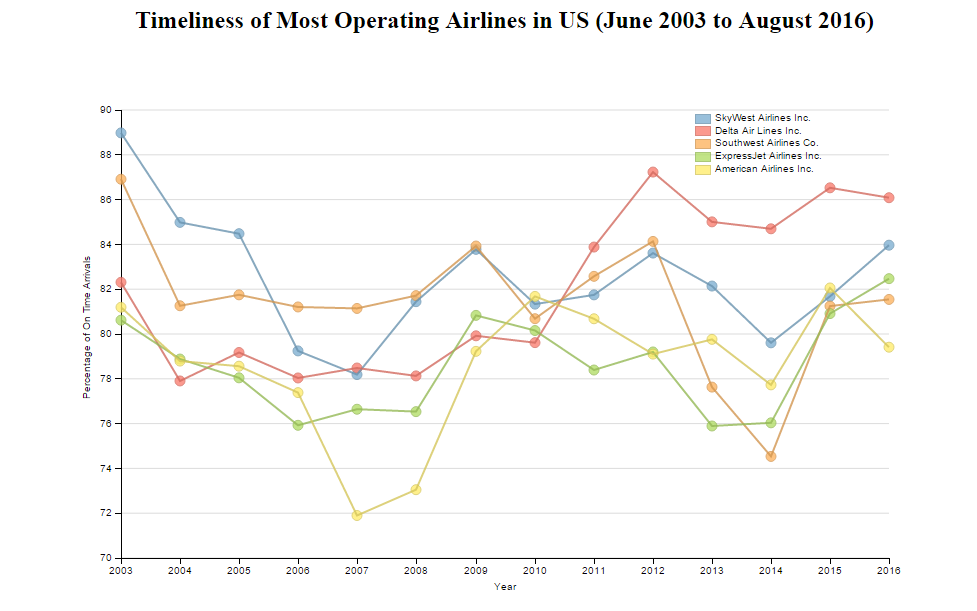
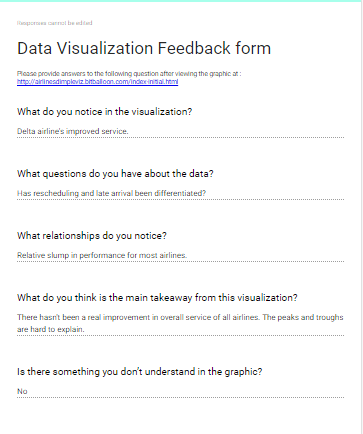
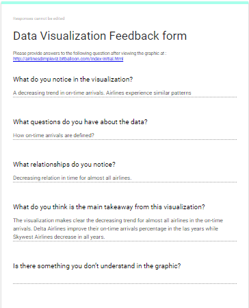
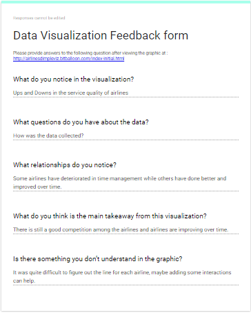
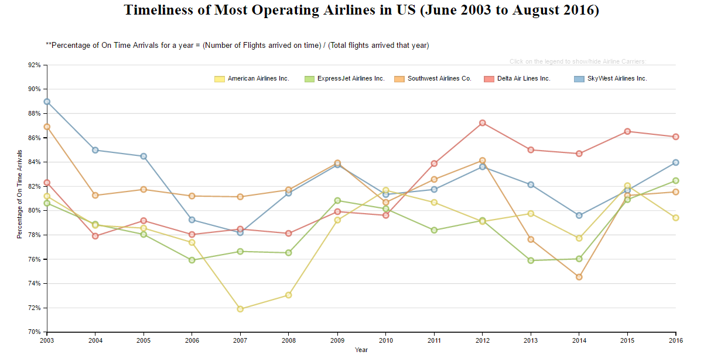
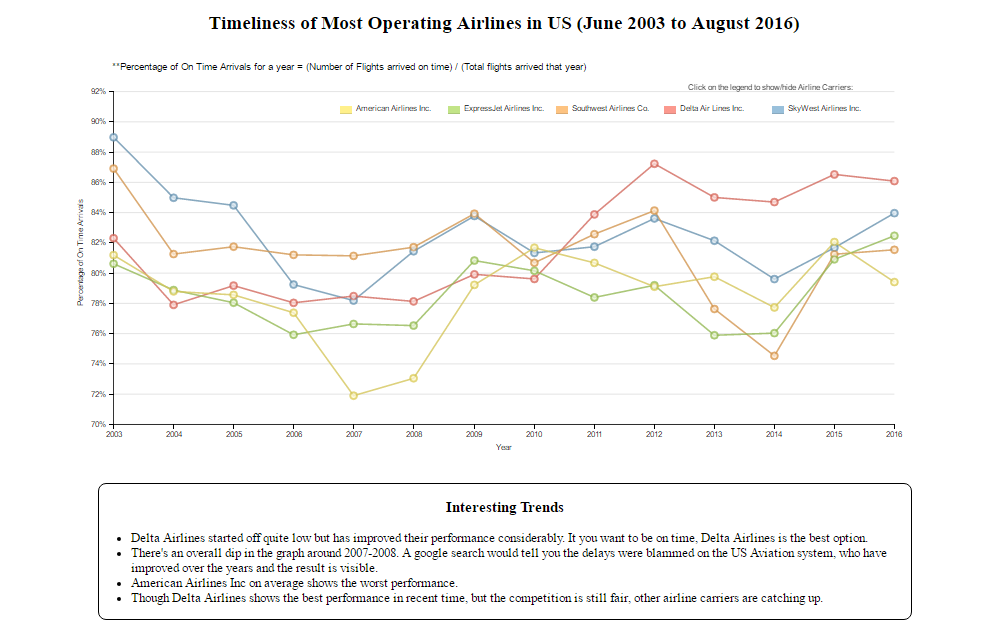

## Data Visualization Project : Performance of most operating Airlines in U.S (2003 - 2016)

***View the visualization <a href = "http://airlinesdimpleviz.bitballoon.com/" target="_blank"> here </a>***

### Description

> The data shows how airlines have performed the years 2003-2016. It shows the percentage of top 5 carrier's flights that were on time (within 15 minutes of sheduled time) for each year. Source of data : <a href = "http://www.transtats.bts.gov/OT_Delay/OT_DelayCause1.asp?pn=1" target="_blank">RITA</a>

***Outcomes***
<ul>
<li>Delta Airlines started off quite low but has improved their performance considerably. It you want to be on time, Delta Airlines is the best option.</li>
<li>There's an overall dip in the graph around 2007-2008. A google search would tell you the delays were blammed on the US Aviation system, who have improved over the years and the result is visible.
</li>
<li>American Airlines Inc on average shows the worst performance.</li>	
<li>Though Delta Airlines shows the best performance in recent time, but the competition is still fair, other airline carriers are catching up. </li>
</ul>

## Design

>The Initial data cleaning was performed using RStudio. The code is mentioned in `data/data_cleaning.r` The original data `airlines_data.csv` had a size of 37MB. This was too large to load on a web-browser over internet. So, I decided to perform some EDA and decide what to plot for the final visualizations. I drew pair plots, scatter plots and histograms to look at the data. Finally I decided to show how various airlines have performed over the years in terms of timely arrivals.

> The data was still large. Plotting about 30 airlines was not possible at once. I would hamper the visual and make it unreadable. So, I decided to filter out the airlines those have the most arrivals on an average over the years. Thus, the data was reduced to few kilobytes and and had details about the top 5 airlines. 

>For the visualization, I decided to use line plot but to highlight or make all the data points visible I also added a scatter plot. The scatterplot (data points) are equipped with a tooltip which describe the data values of that point when the cursor is placed over that point. I used dimple.js for various plotting functions like adding x and y axis, drawing scatter and line plots, animating the line entry and exit and adding legends . The line drawing effect was created using some css properties which gives the effect of the line being drawin in real time. For rest of the functions like adding a title, importing the data and other were done using d3.js.

### Visualization using dimple.js and d3.js

> This iteration can be viewed in `index-initial.html`

## Feedback

> I created a google form that was mentioned on the visualization page. These are the best responses I received :

### Feedback 1

### Feedback 2

### Feedback 3

### Post-feedback design

> I change the following features. 
>* 1. Added an info on how on time arrivals were calculated
>* 2. Added Interaction : user can select whic airlines to view by clicking on the legend
>* 3. Added Interaction : the line for each carrier highlights on hover, makes it easier to clearly view each line.
>* 4. Edited the scale on y axis so that most of the graph is utilized to represent the data

> I belive rest of the questions were not possible to answer using this graphic as it's aim isn't related to those questions or adding more details may takeup more space and make the visual a bit messy.

> This iteration can be viewed in `index1.html`

***Final Iteration***

> Some highlights of the visual were added to the `Interesting trends` section of the page to improve viewer's understanding .
> This iteration can be viewed in `index.html`

### References

1. Udacity data visualization course
2. stackoverflow.com
3. RITA - The source of data
4. d3 and dimple.js documentation
5. <a href = "http://dimplejs.org/advanced_examples_viewer.html?id=advanced_interactive_legends" target="_blank">Building interactive legends</a>
