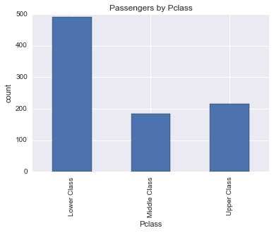
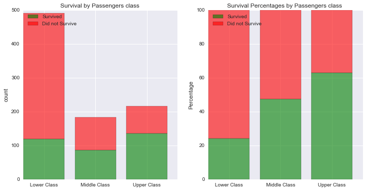
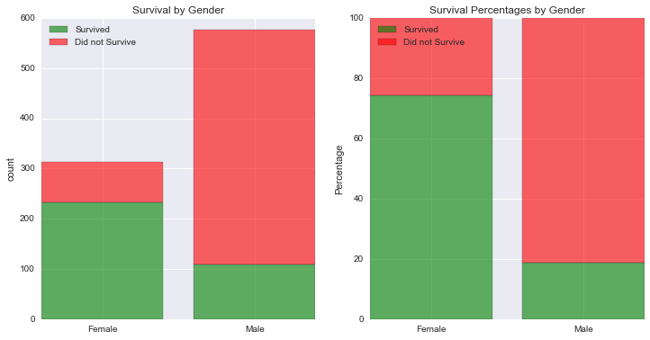
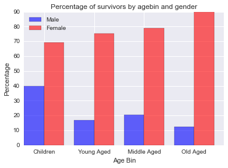
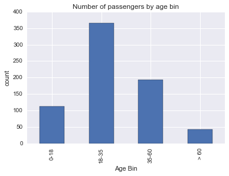
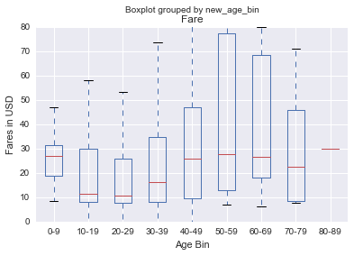
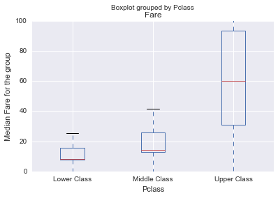
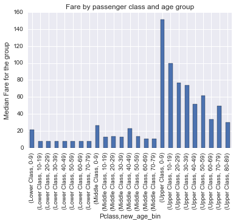

## Investigate a Data set (Titanic Dataset Analysis)

### 1. Introduction

>This dataset contains demographics and passenger information from 891 of the 2224 passengers and crew on board the Titanic. You can view a description of this dataset on the Kaggle website, where the data was obtained (https://www.kaggle.com/c/titanic/data).

> The purpose of this project is to perform analysis (cleaning, organizing, analysing questions or trends in the data) on the sample dataset

> After analysing the dataset, I decided to investigate further on the following questions :
1. Were social-economic standing a factor in survival rate?
2. Which gender had a better chance of survival?
3. Which age group survived the most?

### 2. Importing necessary Libraries

```python
import pandas as pd
import numpy as np
import seaborn as sns
from matplotlib import pyplot as plt
from pprint import pprint
from scipy import stats
from __future__ import division

%pylab inline
```

    Populating the interactive namespace from numpy and matplotlib
    

### 3. Initial Data Analysis

#### 3.1 Reading the Data into Dataframe

```python
titanic_data = pd.read_csv('titanic_data.csv')
```

#### 3.2 Data Description

(from https://www.kaggle.com/c/titanic)

* survival Survival (0 = No; 1 = Yes)
* pclass Passenger Class (1 = 1st; 2 = 2nd; 3 = 3rd)
* name Name
* sex Sex
* age Age
* sibsp Number of Siblings/Spouses Aboard
* parch Number of Parents/Children Aboard
* ticket Ticket Number
* fare Passenger Fare
* cabin Cabin
* embarked Port of Embarkation (C = Cherbourg; Q = Queenstown; S = Southampton)

#### SPECIAL NOTES:

>Pclass is a proxy for socio-economic status (SES) 1st ~ Upper; 2nd ~ Middle; 3rd ~ Lower

>Age is in Years; Fractional if Age less than One (1) If the Age is Estimated, it is in the form xx.5

>With respect to the family relation variables (i.e. sibsp and parch) some relations were ignored. The following are the definitions used for sibsp and parch.

* Sibling: Brother, Sister, Stepbrother, or Stepsister of Passenger Aboard Titanic
* Spouse: Husband or Wife of Passenger Aboard Titanic (Mistresses and Fiances Ignored)
* Parent: Mother or Father of Passenger Aboard Titanic
* Child: Son, Daughter, Stepson, or Stepdaughter of Passenger Aboard Titanic

### 3. Basic Structure of the Data

```python
titanic_data.head()
```
<div>
<table border="1" class="dataframe">
  <thead>
    <tr style="text-align: right;">
      <th></th>
      <th>PassengerId</th>
      <th>Survived</th>
      <th>Pclass</th>
      <th>Name</th>
      <th>Sex</th>
      <th>Age</th>
      <th>SibSp</th>
      <th>Parch</th>
      <th>Ticket</th>
      <th>Fare</th>
      <th>Cabin</th>
      <th>Embarked</th>
    </tr>
  </thead>
  <tbody>
    <tr>
      <th>0</th>
      <td>1</td>
      <td>0</td>
      <td>3</td>
      <td>Braund, Mr. Owen Harris</td>
      <td>male</td>
      <td>22.0</td>
      <td>1</td>
      <td>0</td>
      <td>A/5 21171</td>
      <td>7.2500</td>
      <td>NaN</td>
      <td>S</td>
    </tr>
    <tr>
      <th>1</th>
      <td>2</td>
      <td>1</td>
      <td>1</td>
      <td>Cumings, Mrs. John Bradley (Florence Briggs Th...</td>
      <td>female</td>
      <td>38.0</td>
      <td>1</td>
      <td>0</td>
      <td>PC 17599</td>
      <td>71.2833</td>
      <td>C85</td>
      <td>C</td>
    </tr>
    <tr>
      <th>2</th>
      <td>3</td>
      <td>1</td>
      <td>3</td>
      <td>Heikkinen, Miss. Laina</td>
      <td>female</td>
      <td>26.0</td>
      <td>0</td>
      <td>0</td>
      <td>STON/O2. 3101282</td>
      <td>7.9250</td>
      <td>NaN</td>
      <td>S</td>
    </tr>
    <tr>
      <th>3</th>
      <td>4</td>
      <td>1</td>
      <td>1</td>
      <td>Futrelle, Mrs. Jacques Heath (Lily May Peel)</td>
      <td>female</td>
      <td>35.0</td>
      <td>1</td>
      <td>0</td>
      <td>113803</td>
      <td>53.1000</td>
      <td>C123</td>
      <td>S</td>
    </tr>
    <tr>
      <th>4</th>
      <td>5</td>
      <td>0</td>
      <td>3</td>
      <td>Allen, Mr. William Henry</td>
      <td>male</td>
      <td>35.0</td>
      <td>0</td>
      <td>0</td>
      <td>373450</td>
      <td>8.0500</td>
      <td>NaN</td>
      <td>S</td>
    </tr>
  </tbody>
</table>
</div>

```python
titanic_data.tail()
```
<div>
<table border="1" class="dataframe">
  <thead>
    <tr style="text-align: right;">
      <th></th>
      <th>PassengerId</th>
      <th>Survived</th>
      <th>Pclass</th>
      <th>Name</th>
      <th>Sex</th>
      <th>Age</th>
      <th>SibSp</th>
      <th>Parch</th>
      <th>Ticket</th>
      <th>Fare</th>
      <th>Cabin</th>
      <th>Embarked</th>
    </tr>
  </thead>
  <tbody>
    <tr>
      <th>886</th>
      <td>887</td>
      <td>0</td>
      <td>2</td>
      <td>Montvila, Rev. Juozas</td>
      <td>male</td>
      <td>27.0</td>
      <td>0</td>
      <td>0</td>
      <td>211536</td>
      <td>13.00</td>
      <td>NaN</td>
      <td>S</td>
    </tr>
    <tr>
      <th>887</th>
      <td>888</td>
      <td>1</td>
      <td>1</td>
      <td>Graham, Miss. Margaret Edith</td>
      <td>female</td>
      <td>19.0</td>
      <td>0</td>
      <td>0</td>
      <td>112053</td>
      <td>30.00</td>
      <td>B42</td>
      <td>S</td>
    </tr>
    <tr>
      <th>888</th>
      <td>889</td>
      <td>0</td>
      <td>3</td>
      <td>Johnston, Miss. Catherine Helen "Carrie"</td>
      <td>female</td>
      <td>NaN</td>
      <td>1</td>
      <td>2</td>
      <td>W./C. 6607</td>
      <td>23.45</td>
      <td>NaN</td>
      <td>S</td>
    </tr>
    <tr>
      <th>889</th>
      <td>890</td>
      <td>1</td>
      <td>1</td>
      <td>Behr, Mr. Karl Howell</td>
      <td>male</td>
      <td>26.0</td>
      <td>0</td>
      <td>0</td>
      <td>111369</td>
      <td>30.00</td>
      <td>C148</td>
      <td>C</td>
    </tr>
    <tr>
      <th>890</th>
      <td>891</td>
      <td>0</td>
      <td>3</td>
      <td>Dooley, Mr. Patrick</td>
      <td>male</td>
      <td>32.0</td>
      <td>0</td>
      <td>0</td>
      <td>370376</td>
      <td>7.75</td>
      <td>NaN</td>
      <td>Q</td>
    </tr>
  </tbody>
</table>
</div>

### 3.4 Summary of the Data set

```python
titanic_data.describe(exclude=[type(None)])
```
<div>
<table border="1" class="dataframe">
  <thead>
    <tr style="text-align: right;">
      <th></th>
      <th>PassengerId</th>
      <th>Survived</th>
      <th>Pclass</th>
      <th>Age</th>
      <th>SibSp</th>
      <th>Parch</th>
      <th>Fare</th>
    </tr>
  </thead>
  <tbody>
    <tr>
      <th>count</th>
      <td>891.000000</td>
      <td>891.000000</td>
      <td>891.000000</td>
      <td>714.000000</td>
      <td>891.000000</td>
      <td>891.000000</td>
      <td>891.000000</td>
    </tr>
    <tr>
      <th>mean</th>
      <td>446.000000</td>
      <td>0.383838</td>
      <td>2.308642</td>
      <td>29.699118</td>
      <td>0.523008</td>
      <td>0.381594</td>
      <td>32.204208</td>
    </tr>
    <tr>
      <th>std</th>
      <td>257.353842</td>
      <td>0.486592</td>
      <td>0.836071</td>
      <td>14.526497</td>
      <td>1.102743</td>
      <td>0.806057</td>
      <td>49.693429</td>
    </tr>
    <tr>
      <th>min</th>
      <td>1.000000</td>
      <td>0.000000</td>
      <td>1.000000</td>
      <td>0.420000</td>
      <td>0.000000</td>
      <td>0.000000</td>
      <td>0.000000</td>
    </tr>
    <tr>
      <th>25%</th>
      <td>223.500000</td>
      <td>0.000000</td>
      <td>2.000000</td>
      <td>20.125000</td>
      <td>0.000000</td>
      <td>0.000000</td>
      <td>7.910400</td>
    </tr>
    <tr>
      <th>50%</th>
      <td>446.000000</td>
      <td>0.000000</td>
      <td>3.000000</td>
      <td>28.000000</td>
      <td>0.000000</td>
      <td>0.000000</td>
      <td>14.454200</td>
    </tr>
    <tr>
      <th>75%</th>
      <td>668.500000</td>
      <td>1.000000</td>
      <td>3.000000</td>
      <td>38.000000</td>
      <td>1.000000</td>
      <td>0.000000</td>
      <td>31.000000</td>
    </tr>
    <tr>
      <th>max</th>
      <td>891.000000</td>
      <td>1.000000</td>
      <td>3.000000</td>
      <td>80.000000</td>
      <td>8.000000</td>
      <td>6.000000</td>
      <td>512.329200</td>
    </tr>
  </tbody>
</table>
</div>

### 4. Data Cleaning / Organizing / Wrangling

#### 4.1 Checking for Missing values

```python
titanic_data.info()
```

    <class 'pandas.core.frame.DataFrame'>
    RangeIndex: 891 entries, 0 to 890
    Data columns (total 12 columns):
    PassengerId    891 non-null int64
    Survived       891 non-null int64
    Pclass         891 non-null int64
    Name           891 non-null object
    Sex            891 non-null object
    Age            714 non-null float64
    SibSp          891 non-null int64
    Parch          891 non-null int64
    Ticket         891 non-null object
    Fare           891 non-null float64
    Cabin          204 non-null object
    Embarked       889 non-null object
    dtypes: float64(2), int64(5), object(5)
    memory usage: 83.6+ KB
    


```python
titanic_data.isnull().sum()
```


    PassengerId      0
    Survived         0
    Pclass           0
    Name             0
    Sex              0
    Age            177
    SibSp            0
    Parch            0
    Ticket           0
    Fare             0
    Cabin          687
    Embarked         2
    dtype: int64


> The Age field has a lot of missing values, and the Embarked field also has a couple of nan values. We may replace them with the mean of the group so that they donot effect our calculations or remove them. We will decide on this at a later stage.

#### 4.1.1 Missing Ages


```python
missing_age_male = titanic_data['Survived'][ (titanic_data.Sex =='male') & titanic_data.Age.isnull() ]

missing_age_female = titanic_data['Survived'][ (titanic_data.Sex =='female') & titanic_data.Age.isnull() ]

print 'Number of missing age of male : ',missing_age_male.count(), 
print '\tSurvived : ', missing_age_male.sum()

print 'Number of missing age of female : ',missing_age_female.count(), 
print '\tSurvived : ', missing_age_female.sum()
```

    Number of missing age of male :  124 	Survived :  16
    Number of missing age of female :  53 	Survived :  36
    

>Missing Age data will affect our third question of analysis (Which age group survived the most). But graphing and summations shouldn't be a problem since they will be not be considered during our calculations. We also can't replace them with the mean of the dataset as it would drastically increase the number of survivals in a particular age group. 

>However, 177 is roughly 20% of our 891 sample dataset which seems like a lot to remove from the dataset. 
We should keep note of the proportions across male and female...
* Age missing in male data: 124
* Age missing in female data: 53

#### 4.1.2 Mising Embarkment port


```python
titanic_data[titanic_data.Embarked.isnull()]
```


<div>
<table border="1" class="dataframe">
  <thead>
    <tr style="text-align: right;">
      <th></th>
      <th>PassengerId</th>
      <th>Survived</th>
      <th>Pclass</th>
      <th>Name</th>
      <th>Sex</th>
      <th>Age</th>
      <th>SibSp</th>
      <th>Parch</th>
      <th>Ticket</th>
      <th>Fare</th>
      <th>Cabin</th>
      <th>Embarked</th>
    </tr>
  </thead>
  <tbody>
    <tr>
      <th>61</th>
      <td>62</td>
      <td>1</td>
      <td>1</td>
      <td>Icard, Miss. Amelie</td>
      <td>female</td>
      <td>38.0</td>
      <td>0</td>
      <td>0</td>
      <td>113572</td>
      <td>80.0</td>
      <td>B28</td>
      <td>NaN</td>
    </tr>
    <tr>
      <th>829</th>
      <td>830</td>
      <td>1</td>
      <td>1</td>
      <td>Stone, Mrs. George Nelson (Martha Evelyn)</td>
      <td>female</td>
      <td>62.0</td>
      <td>0</td>
      <td>0</td>
      <td>113572</td>
      <td>80.0</td>
      <td>B28</td>
      <td>NaN</td>
    </tr>
  </tbody>
</table>
</div>


> Two entries donot have the Embarked field specified. Since this is a very small portion of the dataset we can ignore this while performing our calculations.

### 4.2 Checking for unexpected data values


```python
data_check = False

check_survival =0
check_sex = 0
check_pclass = 0
check_embarked = 0


print titanic_data['Survived'].unique()
print titanic_data['Sex'].unique()
print titanic_data['Pclass'].unique()
print titanic_data['Embarked'].unique()  
```

    [0 1]
    ['male' 'female']
    [3 1 2]
    ['S' 'C' 'Q' nan]
    

>###### Result
>* Sex Field contains only male and female values
>* Survived field has only 0 and 1, no other values
>* Pclass has 3, 2, 1 as it values no other classes 
>* We knew that the Embarked column has 2 nan values, all others are as expected.

### 4.3 Removing unwanted fields


```python
titanic_data = titanic_data.drop(['Name', 'Ticket', 'Cabin'], axis=1)
titanic_data.head()
```


<div>
<table border="1" class="dataframe">
  <thead>
    <tr style="text-align: right;">
      <th></th>
      <th>PassengerId</th>
      <th>Survived</th>
      <th>Pclass</th>
      <th>Sex</th>
      <th>Age</th>
      <th>SibSp</th>
      <th>Parch</th>
      <th>Fare</th>
      <th>Embarked</th>
    </tr>
  </thead>
  <tbody>
    <tr>
      <th>0</th>
      <td>1</td>
      <td>0</td>
      <td>3</td>
      <td>male</td>
      <td>22.0</td>
      <td>1</td>
      <td>0</td>
      <td>7.2500</td>
      <td>S</td>
    </tr>
    <tr>
      <th>1</th>
      <td>2</td>
      <td>1</td>
      <td>1</td>
      <td>female</td>
      <td>38.0</td>
      <td>1</td>
      <td>0</td>
      <td>71.2833</td>
      <td>C</td>
    </tr>
    <tr>
      <th>2</th>
      <td>3</td>
      <td>1</td>
      <td>3</td>
      <td>female</td>
      <td>26.0</td>
      <td>0</td>
      <td>0</td>
      <td>7.9250</td>
      <td>S</td>
    </tr>
    <tr>
      <th>3</th>
      <td>4</td>
      <td>1</td>
      <td>1</td>
      <td>female</td>
      <td>35.0</td>
      <td>1</td>
      <td>0</td>
      <td>53.1000</td>
      <td>S</td>
    </tr>
    <tr>
      <th>4</th>
      <td>5</td>
      <td>0</td>
      <td>3</td>
      <td>male</td>
      <td>35.0</td>
      <td>0</td>
      <td>0</td>
      <td>8.0500</td>
      <td>S</td>
    </tr>
  </tbody>
</table>
</div>


> These fields donot have any importance with respect to the questions we are investigating on.

### 4.4 Create new field - Age Bin 

> The field age bin would help us to investigate the group that survived the most without much effort.


```python
def map_age_bin(age):
    if age < 18:
        return '0-18'
    if age < 35:
        return '18-35'
    elif age < 55:
        return '35-60'
    elif not math.isnan(age):
        return '> 60'
    
titanic_data['Age Bin'] = titanic_data['Age'].apply(map_age_bin)
titanic_data.head()
```


<div>
<table border="1" class="dataframe">
  <thead>
    <tr style="text-align: right;">
      <th></th>
      <th>PassengerId</th>
      <th>Survived</th>
      <th>Pclass</th>
      <th>Sex</th>
      <th>Age</th>
      <th>SibSp</th>
      <th>Parch</th>
      <th>Fare</th>
      <th>Embarked</th>
      <th>Age Bin</th>
    </tr>
  </thead>
  <tbody>
    <tr>
      <th>0</th>
      <td>1</td>
      <td>0</td>
      <td>3</td>
      <td>male</td>
      <td>22.0</td>
      <td>1</td>
      <td>0</td>
      <td>7.2500</td>
      <td>S</td>
      <td>18-35</td>
    </tr>
    <tr>
      <th>1</th>
      <td>2</td>
      <td>1</td>
      <td>1</td>
      <td>female</td>
      <td>38.0</td>
      <td>1</td>
      <td>0</td>
      <td>71.2833</td>
      <td>C</td>
      <td>35-60</td>
    </tr>
    <tr>
      <th>2</th>
      <td>3</td>
      <td>1</td>
      <td>3</td>
      <td>female</td>
      <td>26.0</td>
      <td>0</td>
      <td>0</td>
      <td>7.9250</td>
      <td>S</td>
      <td>18-35</td>
    </tr>
    <tr>
      <th>3</th>
      <td>4</td>
      <td>1</td>
      <td>1</td>
      <td>female</td>
      <td>35.0</td>
      <td>1</td>
      <td>0</td>
      <td>53.1000</td>
      <td>S</td>
      <td>35-60</td>
    </tr>
    <tr>
      <th>4</th>
      <td>5</td>
      <td>0</td>
      <td>3</td>
      <td>male</td>
      <td>35.0</td>
      <td>0</td>
      <td>0</td>
      <td>8.0500</td>
      <td>S</td>
      <td>35-60</td>
    </tr>
  </tbody>
</table>
</div>


### 4.5 Mapping Data Items to Values

> In order to intrepret the data easier the following fields need to be modified:
1. Survived - changed to boolean (1 = True, 0 = False)
2. Pclass - changed to Socio-Economic status (1st - Upper Class, 2nd - Middle Class, 3rd - Lower Class)
3. Embarked - changed to name of embarkation port (C = Cherbourg; Q = Queenstown; S = Southampton)


```python
def map_values(df):
    
    # survived 
    survived_values = {0: False, 1: True}
    df['Survived'] = df['Survived'].map(survived_values)

    # PClass 
    pclass_values = {1: 'Upper Class', 2: 'Middle Class', 3: 'Lower Class'}
    df['Pclass'] = df['Pclass'].map(pclass_values)

    # Embarkation port 
    port_values = {'S': 'Southampton', 'C': 'Cherbourg','Q':'Queenstown'}
    df['Embarked'] = df['Embarked'].map(port_values)
    
    return df

titanic_data = map_values(titanic_data)
titanic_data.head()
```


<div>
<table border="1" class="dataframe">
  <thead>
    <tr style="text-align: right;">
      <th></th>
      <th>PassengerId</th>
      <th>Survived</th>
      <th>Pclass</th>
      <th>Sex</th>
      <th>Age</th>
      <th>SibSp</th>
      <th>Parch</th>
      <th>Fare</th>
      <th>Embarked</th>
      <th>Age Bin</th>
    </tr>
  </thead>
  <tbody>
    <tr>
      <th>0</th>
      <td>1</td>
      <td>False</td>
      <td>Lower Class</td>
      <td>male</td>
      <td>22.0</td>
      <td>1</td>
      <td>0</td>
      <td>7.2500</td>
      <td>Southampton</td>
      <td>18-35</td>
    </tr>
    <tr>
      <th>1</th>
      <td>2</td>
      <td>True</td>
      <td>Upper Class</td>
      <td>female</td>
      <td>38.0</td>
      <td>1</td>
      <td>0</td>
      <td>71.2833</td>
      <td>Cherbourg</td>
      <td>35-60</td>
    </tr>
    <tr>
      <th>2</th>
      <td>3</td>
      <td>True</td>
      <td>Lower Class</td>
      <td>female</td>
      <td>26.0</td>
      <td>0</td>
      <td>0</td>
      <td>7.9250</td>
      <td>Southampton</td>
      <td>18-35</td>
    </tr>
    <tr>
      <th>3</th>
      <td>4</td>
      <td>True</td>
      <td>Upper Class</td>
      <td>female</td>
      <td>35.0</td>
      <td>1</td>
      <td>0</td>
      <td>53.1000</td>
      <td>Southampton</td>
      <td>35-60</td>
    </tr>
    <tr>
      <th>4</th>
      <td>5</td>
      <td>False</td>
      <td>Lower Class</td>
      <td>male</td>
      <td>35.0</td>
      <td>0</td>
      <td>0</td>
      <td>8.0500</td>
      <td>Southampton</td>
      <td>35-60</td>
    </tr>
  </tbody>
</table>
</div>


### 4.6 A few functions to help in further calculations


```python
def calculate_percentages_and_counts(field):
    
    survived_by_field = titanic_data[ titanic_data.Survived == True].groupby([field]).size()
    non_survived_by_field = titanic_data[ titanic_data.Survived == False].groupby([field]).size()
    totals = survived_by_field + non_survived_by_field

    survival_counts = survived_by_field.values
    non_survival_counts = non_survived_by_field.values
    survival_percentage = survival_counts*100/totals
    non_survival_percentage = non_survival_counts*100/totals
    
    return [survival_counts, non_survival_counts, survival_percentage, non_survival_percentage]

def x_indices(size):
    
    return np.arange(size) + 0.4
        
    

def plot_bar_chart(survival, non_survival, x_ticks, plt1):
    
    p1 = plt1.bar( range(len(x_ticks)), survival, color = 'g', alpha = 0.6)
    p2 = plt1.bar( range(len(x_ticks)), non_survival, bottom = survival, color = 'r', alpha = 0.6)
    plt1.set_xticks( x_indices( len(x_ticks) ) )
    plt1.set_xticklabels(x_ticks)
    plt1.legend((p1[0], p2[0]), ('Survived', 'Did not Survive'), loc='upper left')
    
    return plt1
    
    
```

## 5. Analysing the Data set

### Q1. Were social-economic standing a factor in survival rate?

##### Over view of the data divided by Passenger's Class

* Pclass is used as a proxy to determine passenger's social-economic status


```python
survived_data = titanic_data[ ['Survived', 'Pclass', 'PassengerId'] ].rename(columns = { 'PassengerId' : 'Passengers'})
survived_data.groupby(['Pclass', 'Survived']).count()
```


<div>
<table border="1" class="dataframe">
  <thead>
    <tr style="text-align: right;">
      <th></th>
      <th></th>
      <th>Passengers</th>
    </tr>
    <tr>
      <th>Pclass</th>
      <th>Survived</th>
      <th></th>
    </tr>
  </thead>
  <tbody>
    <tr>
      <th rowspan="2" valign="top">Lower Class</th>
      <th>False</th>
      <td>372</td>
    </tr>
    <tr>
      <th>True</th>
      <td>119</td>
    </tr>
    <tr>
      <th rowspan="2" valign="top">Middle Class</th>
      <th>False</th>
      <td>97</td>
    </tr>
    <tr>
      <th>True</th>
      <td>87</td>
    </tr>
    <tr>
      <th rowspan="2" valign="top">Upper Class</th>
      <th>False</th>
      <td>80</td>
    </tr>
    <tr>
      <th>True</th>
      <td>136</td>
    </tr>
  </tbody>
</table>
</div>


##### Distribution by each class


```python
count_plot = survived_data.groupby(['Pclass'])['Survived'].count().plot(kind = 'bar', title = 'Passengers by Pclass')
count_plot.set_ylabel('count')
```


    <matplotlib.text.Text at 0xbd10eb8>





##### Proportion of persons who survived in each class


```python
survived_data.groupby(['Pclass'])['Survived'].mean()
```


    Pclass
    Lower Class     0.242363
    Middle Class    0.472826
    Upper Class     0.629630
    Name: Survived, dtype: float64


##### Visualuzations


```python
survival_counts, non_survival_counts, survival_percentage, non_survival_percentage = calculate_percentages_and_counts('Pclass')

classes = ['Lower Class', 'Middle Class', 'Upper Class']

fig, (plt1, plt2) = plt.subplots(1, 2)
fig.set_size_inches(12, 6)

plt1 = plot_bar_chart(survival_counts, non_survival_counts, classes, plt1)
plt1.set_title('Survival by Passengers class ')
plt1.set_ylabel('count')

plt2 = plot_bar_chart(survival_percentage, non_survival_percentage, classes, plt2)
plt2.set_title('Survival Percentages by Passengers class ')
plt2.set_ylabel('Percentage')

plt.show()
```





> The Visuals clearly point out that as we move towards the upper classes, chances of survival increases. To check if our intution is correct, we can perform a chi-squared test to see if the results are statistically significatnt.

> More on chi-test : https://en.wikipedia.org/wiki/Chi-squared_test

> Chi-squared Table : 

##### Hypothesis

* Null Hypothesis      Ho = Social-Economic status has no impact on survival chances of a person

* Alternate Hypothesis Ha = Social-Economic status does impact the chances of survival chances of a person


```python
chi_result = stats.chi2_contingency([ survival_counts, non_survival_counts])

print "Chi-squared value :\t", chi_result[0]
print "P Value :\t", chi_result[1]
```

    Chi-squared value :	102.888988757
    P Value :	4.5492517113e-23
    

#### Conclusion
> Since P value < 0.05 and looking at the chi-table we can figure out that the chi-value lies in the significant region. So We reject the null hypothesis.<br/>

> Thus social-economic status of a person effects the survival chances of a person. A person in upper class is more likely to survive than the ones in the lower ones.

### Q2. Which gender had a better chance of survival?

##### Number of Survivors by sex


```python
survived_data = titanic_data[ ['Sex', 'Survived', 'PassengerId'] ].rename(columns = { 'PassengerId' : 'Passengers'})
survived_data.groupby(['Sex', 'Survived']).count()
```


<div>
<table border="1" class="dataframe">
  <thead>
    <tr style="text-align: right;">
      <th></th>
      <th></th>
      <th>Passengers</th>
    </tr>
    <tr>
      <th>Sex</th>
      <th>Survived</th>
      <th></th>
    </tr>
  </thead>
  <tbody>
    <tr>
      <th rowspan="2" valign="top">female</th>
      <th>False</th>
      <td>81</td>
    </tr>
    <tr>
      <th>True</th>
      <td>233</td>
    </tr>
    <tr>
      <th rowspan="2" valign="top">male</th>
      <th>False</th>
      <td>468</td>
    </tr>
    <tr>
      <th>True</th>
      <td>109</td>
    </tr>
  </tbody>
</table>
</div>


##### Proportion of Men and Women survived


```python
survived_data.groupby('Sex')['Survived'].mean()
```


    Sex
    female    0.742038
    male      0.188908
    Name: Survived, dtype: float64


##### Visualizations


```python
survival_counts, non_survival_counts, survival_percentage, non_survival_percentage = calculate_percentages_and_counts('Sex')

genders = ['Female', 'Male']

fig, (plt1, plt2) = plt.subplots(1, 2)
fig.set_size_inches(12, 6)

plt1 = plot_bar_chart(survival_counts, non_survival_counts, genders, plt1)
plt1.set_title('Survival by Gender')
plt1.set_ylabel('count')

plt2 = plot_bar_chart(survival_percentage, non_survival_percentage, genders, plt2)
plt2.set_title('Survival Percentages by Gender')
plt2.set_ylabel('Percentage')

plt.show()
```





> Thus, we observe a difference of more than 50% for survival rate between the two genders.To check if the result is significant we can carry out chi-squared test to calculate the p-value for the data as it is a categorical data.

##### Hypothesis

* Null Hypothesis      Ho = Gender has no impact on survival chances of a person

* Alternate Hypothesis Ha = Gender does impact the chances of survival chances of a person


```python
chi_result = stats.chi2_contingency([ survival_counts, non_survival_counts])

print "Chi-squared value :\t", chi_result[0]
print "P Value :\t", chi_result[1]
```

    Chi-squared value :	260.717020167
    P Value :	1.19735706278e-58
    

#### Conclusion
> Since P value < 0.05 and looking at the chi-table we can figure out that the chi-value lies in the significant region. So We reject the null hypothesis.<br/>
Thus, we can conclude that Women had a better chance of survival, maybe due to the fact that during evacuations women and children are given preference over men.

### Visualization : Survival by 'Sex' and 'Age Bin' both


```python
male_data_by_agebin = titanic_data[ titanic_data.Sex == 'male'].groupby('Age Bin')['Survived'].mean()*100
female_data_by_agebin = titanic_data[ titanic_data.Sex == 'female'].groupby('Age Bin')['Survived'].mean()*100

age_bins = ['Children', 'Young Aged', 'Middle Aged', 'Old Aged']

plt1 = plt.subplot()
male_index = np.array(range(len(age_bins)))
female_index = np.array(range(len(age_bins)))+0.4
p1 = plt1.bar(male_index, male_data_by_agebin, width=0.4, color='b', alpha = 0.6)
p2 = plt1.bar(female_index, female_data_by_agebin, width=0.4, color='r', alpha = 0.6)
plt.xticks( np.array(range( len(age_bins))) + 0.4,  age_bins)
plt1.set_ylabel("Percentage")
plt1.set_xlabel("Age Bin")
plt1.set_title("Percentage of survivors by agebin and gender")
plt1.legend((p1[0], p2[0]), ('Male', 'Female'), loc='upper left')
plt.show()
```





##### Conclusion
> We also observe that females have a higher chances of survival over each age group and the difference is quite significant.

### Q3. Which age group survived the most?

##### Number of Survivors in each age group


```python
survived_data = titanic_data[ ['Survived', 'Age Bin', 'PassengerId'] ].rename(columns = { 'PassengerId' : 'Passengers'})
survived_data.groupby(['Age Bin', 'Survived']).count()
```


<div>
<table border="1" class="dataframe">
  <thead>
    <tr style="text-align: right;">
      <th></th>
      <th></th>
      <th>Passengers</th>
    </tr>
    <tr>
      <th>Age Bin</th>
      <th>Survived</th>
      <th></th>
    </tr>
  </thead>
  <tbody>
    <tr>
      <th rowspan="2" valign="top">0-18</th>
      <th>False</th>
      <td>52</td>
    </tr>
    <tr>
      <th>True</th>
      <td>61</td>
    </tr>
    <tr>
      <th rowspan="2" valign="top">18-35</th>
      <th>False</th>
      <td>231</td>
    </tr>
    <tr>
      <th>True</th>
      <td>135</td>
    </tr>
    <tr>
      <th rowspan="2" valign="top">35-60</th>
      <th>False</th>
      <td>112</td>
    </tr>
    <tr>
      <th>True</th>
      <td>81</td>
    </tr>
    <tr>
      <th rowspan="2" valign="top">&gt; 60</th>
      <th>False</th>
      <td>29</td>
    </tr>
    <tr>
      <th>True</th>
      <td>13</td>
    </tr>
  </tbody>
</table>
</div>


##### Distribution of passengers by age bin


```python
count_plot = survived_data.groupby(['Age Bin'])['Survived'].count().plot(kind = 'bar', title = 'Number of passengers by age bin')
count_plot.set_ylabel('count')
```


    <matplotlib.text.Text at 0xd206588>





##### Proportion of people who survived


```python
survived_data.groupby(['Age Bin'])['Survived'].mean()
```


    Age Bin
    0-18     0.539823
    18-35    0.368852
    35-60    0.419689
    > 60     0.309524
    Name: Survived, dtype: float64


##### Visualizations


```python
survival_counts, non_survival_counts, survival_percentage, non_survival_percentage = calculate_percentages_and_counts('Age Bin')

age_bins = ['Children', 'Young Aged', 'Middle Aged', 'Old Aged']

fig, (plt1, plt2) = plt.subplots(1, 2)
fig.set_size_inches(12, 6)

plt1 = plot_bar_chart(survival_counts, non_survival_counts, age_bins, plt1)
plt1.set_title('Survival by Passengers class ')
plt1.set_ylabel('count')

plt2 = plot_bar_chart(survival_percentage, non_survival_percentage, age_bins, plt2)
plt2.set_title('Survival Percentages by Passengers class ')
plt2.set_ylabel('Percentage')

plt.show()
```


>Children (age group 0-18) seem to have a higher survival rate than the other groups. To check if the difference is statistically significant, we can carry out a ch-squared test.

##### Hypothesis test

* Null Hypothesis : Ho -> Age of a person doesn't effect the chances of his survial
* Alternative Hypothesis : Ha -> Age of a person does effect the chances of his survial

##### Chi - Test


```python
chi_result = stats.chi2_contingency([ survival_counts, non_survival_counts])

print "Chi-squared value :\t", chi_result[0]
print "P Value :\t", chi_result[1]
```

    Chi-squared value :	12.25483429
    P Value :	0.00655928759607
    

##### Conclusion

>Since P value is far less than 0.05 and looking at the chi-table we can figure out that the chi-value lies in the significant region. So We reject the null hypothesis.
Thus, age of a person does effect the survival rate of a person. We can see from the graph that children had better chances of survival than any other group.

### Additional Analysis : Fare for a person by his age

##### Visualization : Median Fare vs Age Bin


```python
def create_new_age_bin(age):
    x_labels = ['0-9', '10-19', '20-29', '30-39', '40-49', '50-59', '60-69', '70-79', '80-89']
    
    if not np.isnan(age):
        return x_labels[int(age/10)]
    
titanic_data['new_age_bin'] = titanic_data['Age'].apply(create_new_age_bin)
ages_and_fares_plot = titanic_data[ ['new_age_bin', 'Fare'] ].boxplot(by = "new_age_bin")
ages_and_fares_plot.set_ylim([0, 80])
ages_and_fares_plot.set_xlabel('Age Bin')
ages_and_fares_plot.set_ylabel('Fares in USD')
```





> No specific trend can be observed, probably different classes of the passenger is the reason why we don't see a specific pattern. Let us draw some more visualizations.

##### Median Fare by Pclass


```python
ages_and_fares_plot = titanic_data[ ['Pclass', 'Fare'] ].boxplot(by = "Pclass")
ages_and_fares_plot.set_ylabel('Median Fare for the group')
ages_and_fares_plot.set_ylim([0, 100])
ages_and_fares_plot.set_xlabel('Pclass')
```





> Clearly upper class fares are higher than the lower ones.

##### Median Fare by age and class of the person


```python

fares_plot = titanic_data.groupby(['Pclass', 'new_age_bin'])['Fare'].median().plot(kind = 'bar', title = 'Fare by passenger class and age group')
fares_plot.set_ylabel('Median Fare for the group')
```





> Quite surprisingly, fares for children are higher in each class. Probably they require extra care and must have been provided with some better facilities. But, the actual reason for this trend is not known.

### Final Conclusion

>The results of the analysis, although tentative, would appear to indicate that class and sex, namely, being a female with upper social-economic standing (first class), would give one the best chance of survival when the tragedy occurred on the Titanic. Age did not seem to be a major factor although children had better chances of survival. While being a man in third class, gave one the lowest chance of survival.Quite surprisingly, we found out that fares for children were higher that others in each class.

>#### Issues :
* A portion of men and women did not have Age data and were removed from calculations which could have skewed some numbers.
* The category of 'children' was assumed to be anyone under the age of 18, using today's North American standard for adulthood which was certainly not the case in the 1900s.
* Survivor Bias : The data was collected after the titanic sank, since we have the survivors available, it was easier to get more and much accurate information about the survivors rather than those who died.
* The dataset used is just a part (sample) of the actual data. The actual data might show a bit variation from the one we are using.
