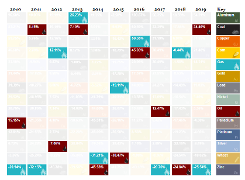

## Malastare AI
## MATHEW HART, RIHAD VARIAWA, JOEY SPREITLER, Data Scientists
## Quantum Capital - Private Fund Management Company

  

Received: 14 July 2019; Accepted: 14 January 2020; Published: 00 January 2020

### A Decade of Commodities (2010-2019)

#### Oil and Gas: Opposite Ends of the Spectrum
As key energy commodities, oil and natural gas have an inherent connection to one another.

However, in 2019, the two commodities had completely diverging performances:

  

Crude oil prices gained 34.5% on the year, making it one of the best commodities for investors — meanwhile, natural gas went the opposite direction, dropping 25.5% on the year. This actually cements gas as the worst performing major commodity of the decade.

  

