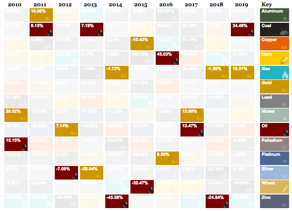
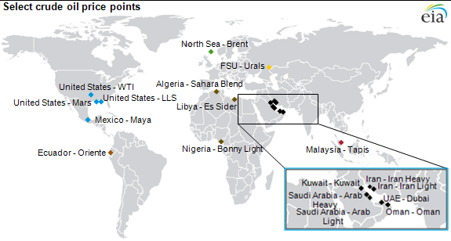
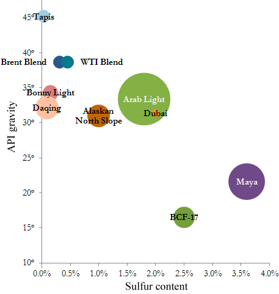
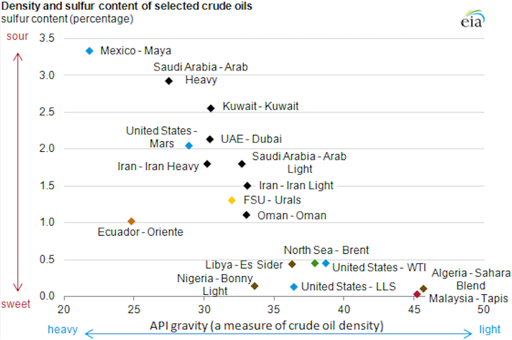

## Malastare AI
## MATHEW HART, RIHAD VARIAWA, JOEY SPREITLER, Data Scientists
## Quantum Capital - Private Fund Management Co.

  

Received: 14 July 2019; Accepted: 10 March 2020; Published: 19 March 2020

### Overview

From highly-instrumented wells to the proliferation of smart grid technologies, data is becoming a critical element in the discovery, extraction, and delivery of energy — whether it is oil, natural gas, or even wind and solar. __Malastare AI__ provides a virtual analytics platform that enables real-time analysis of operational and customer data at scale, making modern innovations like predicting weather patterns and optimizing the energy grid a reality.

The key to success is consistently making good decisions, and the key to making good decisions is having good information. This belief is the main impetus behind the explosive interest in _Big Data_. We all know intuitively that access to more data presents the potential to obtain better data and therefore better decisions, yet more data in-and-of itself does not necessarily result in better decisions. We must also sift through the data and discover the good information. Doing so effectively is especially important in capital intensive industries.

The oil and gas industry is an asset-intensive business with capital assets ranging from _drilling rigs, offshore platforms and wells to pipelines, LNG terminals, and refineries_. These assets are costly to design, build, operate, and maintain. Analysis of the financial statements of the five super-majors (BP, ConocoPhillips, ExxonMobil, Shell, Total) shows that plant, property and equipment on average accounts for 51% of total assets. Effectively managing these assets require the oil and gas industry to leverage advanced machine learning and analytics on extreme large volumes of data, in batch and real-time. _Apache Spark_ is ideal for handling this type of workload and __Malastare AI__ is the ideal platform for building Apache Spark solutions.

As natural resources are the building blocks of the world, essential to progress and prosperity. These commodities, like all investments, can have wide price fluctuations over time. This table shows the ebb and flow of commodity prices over the past decade and illustrates the principle of mean reversion, the concept that returns eventually move back towards their average. The price movement of commodities is historically both seasonal and cyclical. That’s why when investing in natural resources, we believe your portfolio should hold a diversified basket of commodities actively managed by professionals who understand these specialized assets and the global trends impacting them.

  

The heightened technological development in the 21st century would not have been possible without the contribution from the oil and gas sector. Our dependence on the crude and its products has made it one of the industrial sectors that contribute around 2 to 3 percent to the overall global economy. In fact, in 2017, the consumption of crude grew by 1.4 million b/d and its production increased by 2.2 million b/d.

It is surely one of the biggest sectors that is powering the global economy, albeit it is also one of the sectors that face numerous challenges. Most of these challenges negatively impact the operational efficiency of oil companies and disrupt the continuous flow of crude and petroleum products in all of its segments.

The technology of (AI) Artificial Intelligence supports various industrial operations which in turn alleviate all these challenges. Let us explore every benefit that machine learning offers in resolving these challenges and optimizing our trading strategy:

__Oil & Gas:__ 
Commodity cycles, capital planning challenges, and increasing operational risks in the oil and gas industry are all factors that make it more important than ever to make smarter and more efficient decisions. With AI and machine learning, companies can deliver the returns investors require, improve ROAs, and manage downside risks by turning much of the data already collected into usable and valuable insight.

__AI, Oil & Gas:__ 
With the dynamic landscape for energy production, AI provides powerful benefits across the entire value chain. AI helps oil and gas companies assess the value of specific reservoirs, customize drilling and completion plans according to the geology of the area, and assess risks of each individual well. In addition, downstream operations can be optimized to minimize costs and maximize spreads.

__OPEC contries:__ 
Algeria, Angola, Ecuador, Iran, Iraq, Kuwait, Libya, Nigeria, Qatar, Saudi Arabia, United Arab Emirates and Venezuela. 

__Research:__
The OPEC’s database of crude oil prices is essential to this research. OPEC retains 80% of the world’s oil reserves with a majority of the reserves in the Middle East, amounting to around 66% of the OPEC total. The data was collected over several decades, but only recently uploaded online, and the data itself was collected by the economic cartel as all members must report their oil data. 

__Exploration and Production__

+ Forecast total recoverable reserve volumes
+ Analyze exploration and reservoir data
+ Model well spacing and field development plans
+ Optimize lateral and frac design
+ Model and simulate various proppant and fluid loading options
+ Create lifetime well production models and more effective production forecasts
+ Set bidding strategies for lease blocks based on market behaviors

__Midstream and Refining__

+ Forecast long-term commodity input and product market price
+ Provide capital planning and risk evaluation for better long-term decisions
+ Optimize commodity trading and hedging strategies
+ Improve reliability risk modeling for refining and processing assets
+ Maximize labor productivity and wrench time
+ Enhance asset scheduling for refining and processing operations
+ Optimize pipeline scheduling for product flows

__Oil Field Services and Equipment__

+ Optimize drilling, completion equipment scheduling, and fleet management
+ Manage and optimize supply chains
+ Optimize procurement strategies for proppant, water, and other consumables
+ Identify root causes and drivers of non-productive time
+ Forecast customer demand and drilling activity in the medium and long-term
+ Enhance back-office and invoicing/billing processes
+ Automate financial controls for high-volume transactions

__U.S. Crude Trade__

_U.S. crude oil exports/imports_ is also vital to this research. With a recent lift of a ban preventing oil companies on exporting crude oil to international markets, the importance of U.S. crude oil exportation has a serious impact on the international oil market and has affected how much oil the U.S. imports. In 2013, the U.S. oil industry has produced more crude oil than that of Russian and Saudi Arabian oil producers. 

_Currency data_ is important in this crude oil price analysis as it is well documented that currencies of countries with large oil exporting economies have closely related correlations with crude oil prices internationally. 

The _Foreign Exchange Rate Database_ which is sourced from major banks and dealers, offers synchronized FX rates for 168 currencies dating back to the year 2000. Gold priced in USD showcases the price of Gold in USD. The relation Gold has on Crude Oil Prices is well documented. The overall relationship is well documented. Often times commodity investors spread there investments in other high valued commodities to neutralize/mitigate the risk of investing in other commodities such as oil, which only now like the price of gold has fluctuated greatly. 

The main objective for this project is to model the price movements to forecast energy commodities, namely:

+ Crude (WTI and Brent)
+ Gasoline
+ Heating oil
+ Natural gas

_(WTI)_ is actually sweeter than _(Brent),_ has a sulfur content of around 0.24 percent. WTI is a better grade of crude oil for the production of gasoline while Brent oil favors the production of diesel fuels.

  

In the international petroleum industry, crude oil products are traded on various oil bourses based on established _(chemical profiles)_, _(delivery locations)_, and _(financial terms)_. The __(chemical profiles, or crude oil assays),__ specify important properties such as the oil's API gravity. The __(delivery locations)__ are usually sea ports close to the oil fields from which the crude was obtained (and new fields are constantly being explored), and the __(pricing)__ is usually quoted based on FOB (free on board, excl. consideration of final delivery costs).

The 3 most quoted oil products are:

+ North America's West Texas Intermediate Crude (WTI)
+ North Sea Brent Crude
+ UAE Dubai Crude 

Their pricing is used as a barometer for the entire oil industry, although, in total, there are 46 key oil exporting countries. Brent Crude is typically priced at about USD2 over the WTI Spot price, which is typically priced USD5 to USD6 above the EIA's Imported Refiner Acquisition Cost (IRAC) and OPEC Basket prices. WTI and Brent are quoted F.O.B specific locations, not F.O.B. the oilfields. For WTI, the delivery point is Cushing, OK; for Brent, it is Sullom Voe, located on Shetland, an island archipelago north of mainland Scotland.

Although crude oil assays / chemical profiles evaluate various chemical properties of the oil, the two most important properties determining a crude's value are its _density_ __(measured as API specific gravity)__ and its _sulphur content_ __(measured per mass).__ 

  

Crude oil is considered "heavy" if it has long hydrocarbon chains, or "light" if it has short hydrocarbon chains: an API gravity of 34 or higher is "light", between 31-33 is "medium", and 30 or below is "heavy". Crude is considered "sweet" if it is low in sulphur content (< 0.5%/weight), or "sour" if high (> 1.0%/weight). Generally, the higher the API gravity (the "lighter" it is), the more valuable the crude.

  

### The 4 crude symbols
>WTI is a light, sweet crude oil blend. ‘Light’ refers to its low density and sulfur content, ideal for conversion to gasoline and diesel fuel. The contract’s ticker symbol, CL, refers to “Crude Light.”
  
The contract’s ticker symbol, MT, refers to “Gulf Sour Crude Oil”
  
The contract’s ticker symbol, QA, refers to “Crude Oil Brent”
  
The contract’s ticker symbol, SC, refers to “VIX Crude Oil”

### Business Requirements
By developing a proprietary data source derived from publicly available information published in the primary commodity exchanges. Using this bespoke dataset, our research efforts will be focused on using our domain-knowledge as well as our analytical and quantitative technical capabilities to develop predictive models as they relate to understanding the financial markets for energy commodities.

Our objective here is to not only model and predict the past behavior of the commodities financial markets, but to successfully derive active market strategies that are able to consistently generate a profit, at a lower risk premium, than corresponding passively traded investment vehicles that are available to the public investment. If successful, we would have a product that would serve as an attractive alternative to the public passive investment options that currently account for 45% of the US stock market, or about $3.7 trillion dollars.

There are two main objectives of time series analysis: (a) identifying the nature of the phenomenon represented by the sequence of observations, and (b) forecasting (predicting future values of the time series variable). Both of these goals require that the pattern of observed time series data is identified and more or less formally described. Once the pattern is established, we can interpret and integrate it with other data (i.e., use it in our theory of the investigated phenomenon, e.g., seasonal commodity prices). Regardless of the depth of our understanding and the validity of our interpretation (theory) of the phenomenon, we can extrapolate the identified pattern to predict future events.

__1. Visualizing time series__

In this step, we try to visualize the series. We try to identify all the underlying patterns related to the series like trend and seasonality. Do not worry about these terms right now, as we will discuss them during implementation. You can say that this is more a type of exploratory analysis of time series data.

__2. Stationarising time series__

A stationary time series is one whose statistical properties such as mean, variance, autocorrelation, covariance etc. are all constant over time. Most statistical forecasting methods are based on the assumption that the time series can be rendered approximately stationary (i.e. “stationarised”) through the use of mathematical transformations. A stationarised series is relatively easy to predict: you simply predict that its statistical properties will be the same in the future as they have been in the past! Another reason for trying to stationarise a time series is to be able to obtain meaningful sample statistics such as means, variances, and correlations with other variables. Such statistics are useful as descriptors of future behavior only if the series is stationary. For example, if the series is consistently increasing over time, the sample mean and variance will grow with the size of the sample, and they will always underestimate the mean and variance in future periods. And if the mean and variance of a series are not well-defined, then neither are its correlations with other variables.

__3. Finding the best parameters for our model__

We need to find optimal parameters for forecasting models one’s we have a stationary series. These parameters come from the ACF and PACF plots. Hence, this stage is more about plotting above two graphs and extracting optimal model parameters based on them. Do not worry, we will cover on how to determine these parameters during the implementation part below!

__4. Fitting model__

Once we have our optimal model parameters, we can fit an ARIMA model to learn the pattern of the series. Always remember that time series algorithms work on stationary data only hence making a series stationary is an important aspect.

__5. Predictions__

After fitting our model, we will be predicting the future in this stage. Since we are now familiar with a basic flow of solving a time series problem, let us get to the implementation.

### Regression: forecasting commodity prices
_(Polynomial)_. In statistics, _polynomial regression_ is a form of regression analysis in which the relationship between the independent variable x and the dependent variable y is modelled as an nth degree polynomial in x. Polynomial regression fits a nonlinear relationship between the value of (X) and the corresponding conditional mean of (y), denoted 

$$E(y |x)$$

Although _polynomial regression_ fits a nonlinear model to the data, as a statistical estimation problem it is linear, in the sense that the regression function 

$$E(y | x)$$

is linear in the unknown parameters that are estimated from the data. For this reason, _polynomial regression_ is considered to be a special case of multiple linear regression.

_(Regularization)_. Is a method used to reduce the error by fitting a function appropriately on the given training set thereby avoiding overfitting.

_(L1 & L2 regularization)_. Is the penalty term. __Lasso Regression__ (Least Absolute Shrinkage and Selection Operator), also known as L1, adds “absolute value of magnitude” coefficient as the penalty term to the loss function. 

__Ridge regression__ (L2) adds “squared magnitude” of coefficient as the penalty term to the loss function. A difference between these techniques is that _Ridge_ sets the weights of some features to small values whereas _Lasso_ shrinks the less important features coefficient to zero thus, removing some features altogether. So, this works well for feature selection/dimensionality reduction as we have a huge number of features.

### Gaussian Mixture Model
GMM (Gaussian Mixture Model) is a probabilistic model that assumes that the instances were generated from a mixture of several Gaussian distributions whose parameters are unknown. In this approach we describe each cluster by its centroid (mean), covariance, and the size of the cluster (weight). Therefore, based on this definition, a GMM will be applicable when we know that the data points are mixtures of a _gaussian distribution_ and form clusters with different mean and standard deviation.

### ARIMA
ARIMA (Autoregressive Integrated Moving Average). This is a statistical forecasting technique that uses time series data to predict the future. The parameters used in ARIMA are (P, d, q) which refers to the autoregressive, integrated and moving average parts of the dataset, respectively. _(p defines the number of lags, d specifies the number of differences used, q defines the size of moving average window)_ ARIMA model handles the trends, seasonality, cycles, errors and non-stationary aspects of our dataset when making forecasts.

### Random Forest
_(An Ensemble Learning Method for Regression and Classification)_. It operates by constructing a multitude of decision trees at training time and outputting the class that is the _mode_ of the classes _(classification)_ or _mean_ prediction _(regression)_ of the individual trees.

### XGBoost
_(Boosting Algorithm)_. Often called GBM Killer. Structurally XGBoost uses pre-sorted algorithm and histogram based algorithm for computing the best split.

Understanding how pre-sorting splitting words:

+ for each node, enumerate over all features
+ for each feature, sort the instances by feature value
+ use a linear scan to decide the best split along that feature basis information gain
+ take the best split solution along all the features

In simple terms, Histogram-based algorithm splits all the data points for a feature into discrete bins and uses these bins to find the split value of histogram. While, it is efficient than pre-sorted algorithm in training speed which enumerates all possible split points on the pre-sorted feature values, it is still behind GOSS (Gradient-based One-Side Sampling) in terms of speed.

XGBoost cannot handle categorical features by itself, it only accepts numerical values similar to Random Forest. Hence one has to perform various encodings like label encoding, mean encoding or one-hot-encoding before supplying categorical data to XGBoost.

### Deep Learning (RNN)
_(RNN)_. Best for sequence data. Is a class of artificial neural networks where connections between nodes form a directed graph along a temporal sequence. This allows it to exhibit temporal dynamic behavior. RNNs can use their internal state (memory) to process sequences of inputs. 

### LSTM
Long short-term memory is based on an artificial recurrent neural network (RNN) architecture. LSTM tackles the problem of long-term dependencies of RNN in which the RNN cannot predict the word stored in the long-term memory but can give more accurate predictions from the recent information. LSTM explicitly introduces a memory unit, called the cell into the network. LSTM can retain the information for long period of time.

A common LSTM unit is composed of a cell, an input gate, an output gate, and a forget gate. Each single unit makes decision by considering the current input, previous output and previous memory. And it generates a new output and alters its memory.

LSTM is used for processing, predicting and classifying based on _time series data._ Unlike standard feedforward neural networks, LSTM has feedback connections that make it a general-purpose computer. It cannot only process single data points (such as images), but also entire sequences of data (such as speech or video).

### Central Limit Theorem (CLT)
CLT states that the sampling distribution of the sample mean approached _normal distribution_ as the sample size gets larger no matter what the initial shape of the population distribution is. To make statistical inferences about the data, it is important to understand the CLT. The theorem gives us the ability to quantify the probability that the random sample will deviate from the population without having to take any new sample to compare it with. Because of this theorem, we don’t need the characteristics about the whole population to understand the likelihood of our sample being representative of it. Confidence intervals, hypothesis testing, and p-value analysis is based on the CLT. In a nutshell, CLT can make inferences from a sample about a population.

_(Normal Distribution)_. aka Gaussian Distribution. A type of probability distribution that is symmetric about the mean. It shows that the data is closer to the mean and the frequency of occurrences in the data are far from the mean.

Generally, it is observed that the collection of random data from independent sources is _distributed normally._ We get a bell shape curve on plotting a graph with the value of the variable on the horizontal axis and the count of the values in the vertical axis. The centre of the curve represents the mean of the dataset.

### (GARCH) Generalized AutoRegressive Conditional Heteroskedasticity - for time varying volatility
GARCH is a statistical model used in analyzing time-series data where the variance error is believed to be serially autocorrelated. GARCH models assume that the variance of the error term follows an autoregressive moving average process.

#### What is the GARCH Process
GARCH process is an econometric term developed in 1982 by Robert F. Engle, an economist and 2003 winner of the Nobel Memorial Prize for Economics, to describe an approach to estimate volatility in financial markets. There are several forms of GARCH modeling. The GARCH process is often preferred by financial modeling professionals because it provides a more real-world context than other forms when trying to predict the prices and rates of financial instruments.

#### Breaking Down GARCH Process
Heteroskedasticity describes the irregular pattern of variation of an error term, or variable, in a statistical model. Essentially, where there is heteroskedasticity, observations do not conform to a linear pattern. Instead, they tend to cluster. The result is that the conclusions and predictive value one can draw from the model will not be reliable. GARCH is a statistical model that can be used to analyze a number of different types of financial data, for instance, macroeconomic data.

Financial institutions typically use this model to estimate the volatility of returns for stocks, bonds and market indices. They use the resulting information to help determine pricing and judge which assets will potentially provide higher returns, as well as to forecast the returns of current investments to help in their asset allocation, hedging, risk management and portfolio optimization decisions.

The general process for a GARCH model involves 3 steps. The first is to estimate a best-fitting autoregressive model. The second is to compute autocorrelations of the error term. The third step is to test for significance. Two other widely used approaches to estimating and predicting financial volatility are the classic historical volatility (VolSD) method and the exponentially weighted moving average volatility (VolEWMA) method.

#### Example of GARCH Process
GARCH models help to describe financial markets in which volatility can change, becoming more volatile during periods of financial crises or world events and less volatile during periods of relative calm and steady economic growth. 

On a plot of returns, for example, stock returns may look relatively uniform for the years leading up to a financial crisis such as the one in 2007. In the time period following the onset of a crisis, however, returns may swing wildly from negative to positive territory. Moreover, the increased volatility may be predictive of volatility going forward. Volatility may then return to levels resembling that of pre-crisis levels or be more uniform going forward. A simple regression model does not account for this variation in volatility exhibited in financial markets and is not representative of the "black swan" events that occur more than one would predict.

#### GARCH Models Best for Asset Returns
GARCH processes differ from homoskedastic models, which assume constant volatility and are used in basic ordinary least squares (OLS) analysis. OLS aims to minimize the deviations between data points and a regression line to fit those points. With asset returns, volatility seems to vary during certain periods of time and depend on past variance, making a homoskedastic model not optimal.

GARCH processes, being autoregressive, depend on past squared observations and past variances to model for current variance. GARCH processes are widely used in finance due to their effectiveness in modeling asset returns and inflation. GARCH aims to minimize errors in forecasting by accounting for errors in prior forecasting and, thereby, enhancing the accuracy of ongoing predictions.

<h2>Quantum Capital</h2>

<ul>
	<li><a href="https://r-variawa.rstudio.cloud/f2988da6bff2415a937693aa688ebfca/file_show?path=%2Fcloud%2Fproject%2FMS-DataScience%2FQuantum_Capital%2FQuantumCapitalOverview.pdf">EXECUTIVE SUMMARY</a></li>
	<li><a href="https://r-variawa.rstudio.cloud/f2988da6bff2415a937693aa688ebfca/file_show?path=%2Fcloud%2Fproject%2FMS-DataScience%2FQuantum_Capital%2FQuantumCapital.pdf">INVESTOR PITCH</a></li>
	<li><a href="https://r-variawa.rstudio.cloud/f2988da6bff2415a937693aa688ebfca/file_show?path=%2Fcloud%2Fproject%2FMS-DataScience%2FQuantum_Capital%2FRVariawa_Research.pdf">COMMODITY PRICE PREDICTION AND RESEARCH</a></li>
	<li><a href="https://r-variawa.rstudio.cloud/f2988da6bff2415a937693aa688ebfca/?view=rmarkdown/">INVESTOR DASHBOARD</a></li>
</ul>

  

