Building a startup that is focused exclusively on data science projects in two hypergrowth industries, blockchain, and artificial intelligence is truly exciting and game-changing. The reality is Malastare is a hypergrowth startup and it just isn’t for everyone. Unapologetically, we work hard, run hard, keep bureaucracy to a minimum and hold ourselves accountable in our quest to build something special. If these things interest you, you are in the right place.

We are a team of product visionaries, talented engineers, data scientists, and customer-obsessed inventors who tackle the world’s most complex deep learning, artificial intelligence challenges in order to deliver best-in-class infrastructure and software solutions.

Our cutting-edge engineers and data scientists create disruptive real-world applications to realize the promise of nascent blockchain and AI technologies and provide highly secure and feature-rich solutions for our customers. We leverage the most advanced deep learning neural networks, based on best-in-class sentiment analysis and market analytics.

We are a startup with a strong impetus to innovate, drive end to end ownership and meet critical business goals. You get to rub shoulders daily with outstanding software, hardware and embedded engineers, data scientists, UX designers and the executive leadership team in an environment of high-speed learning and professional development. Our employees thrive in a unique team environment where energy, creativity, and collaboration drive innovation.

## Our expertise covers the following:

### Business Logistics, Including Supply Chain Optimization
Supply chain plays an important role in tracking the goods and services that a company manufactures. This asset of the company was initially undertaken with the help of management tools until the advent of analytics. Analytics uses the historical enterprise data to train predictive models in machine learning that make informed business decisions. It enables one to identify inefficiencies to capture greater cost savings. Sometimes, risk modeling is conducted to do a “pre-mortem” for future threats. Analytics are also useful in identifying the key factors that enable better functioning of supply chain management.

### FinTech Industries
After the recession in 2008 hit the financial sector and left everyone panting for more, the importance of Big Data in finance was realized. The BFSI (Banking and Finance Services Industry) came up with many sorts of data and along with many sorts of problems which were only possible to solve with the help of big data.

The three Vs of big data - **velocity,** **volume** and **variety** have accelerated the banking sector in various aspects. In investment banking, the volume of data is growing manifold day-by-day and so has its velocity. Cloud computing and Hadoop have enabled the big data platforms to cater to the tremendous volume of data. Banks have now realized the potential of big data and are employing the same in their systems to make it future-proof.

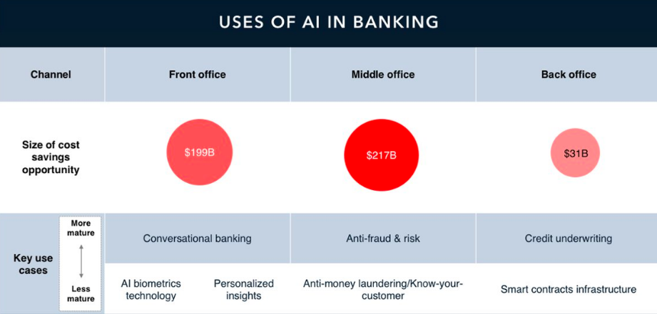

### Health And Wellness
The evolution of the healthcare domain was only observed after big healthcare organizations started investing in big data. The amount at which the data was flowing in, made it difficult for the traditional data-processing application software to cope with the data. Big data has tools like Hadoop, MapReduce, Hive, Pig which help in proper management of big volumes of data as well as in processing it for the welfare of the domain. At times, cancer is untraceable in a human body which leads to late detection or no detection at all. Big data helps in solving that problem.

Patients need their body-metrics tracked every time which involves everything from heartbeat to sugar levels. Big data takes care of that too.

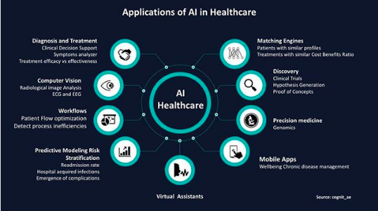

### Education And Electronic Teaching
Online teaching and education are taking the market by storm as it is been adopted by more and more organizations. Online courses which can be accessed from anywhere are being recommended. The recommender system in data science is implemented for this purpose and assigns courses as per one`s interests.

### Climate And Energy
Weather forecasting is the most common application and it has been operating for quite a long time. Predicting any weather changes like storms, thunder, heavy rainfall makes it easy for forecasters to analyze and understand the future scenario much better. Issues like carbon emissions and hike in the level of the sea due to glaciers, environmental changes, and ecological disbalances can be calculated before its advent have any catastrophic effects on nature and human lives.

## Data Processing Overview

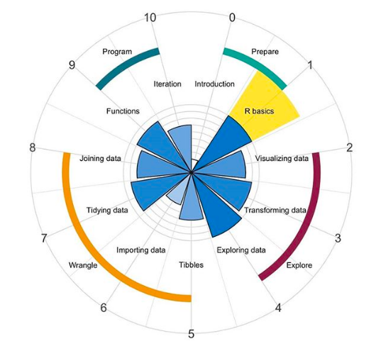

### Python Workflow

To carry out data cleansing, data transformation, statistical modeling, data visualization, machine learning, and countless more.

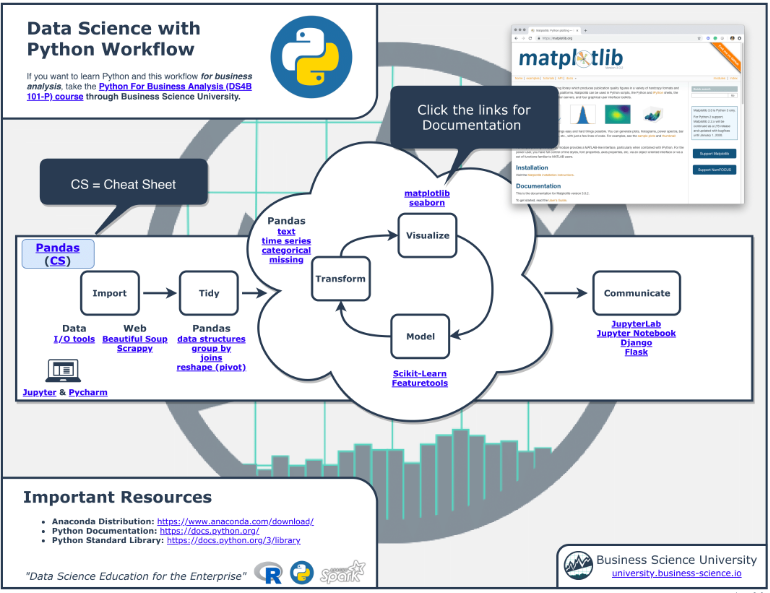

### RStudio Workflow
To perform operations on data. 

R takes care of visualization by providing a shiny tool. RShiny takes care of interactive web applications for visualizing data which brings data analysis in R to life.

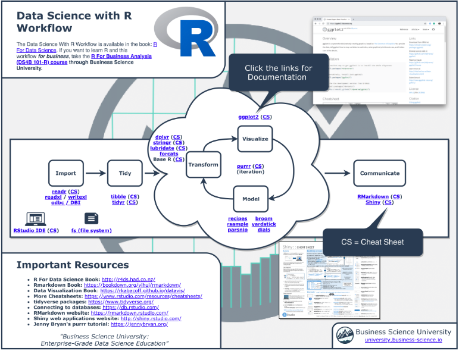

### Apache Spark
Used to execute projects in Scala, Java, SQL, Python, or R. Considered as a unified engine which is used to take analytical decisions from large-scale data processing.

For managing clusters, Spark provides standalone Hadoop YARN.
For distributed storage, Spark offers an interface with a wide variety of applications like Hadoop Distributed File System, MapReduce File System, Cassandra.

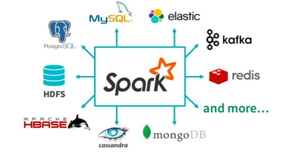

### Microsoft Excel
To carry out calculations, visualize graphs.

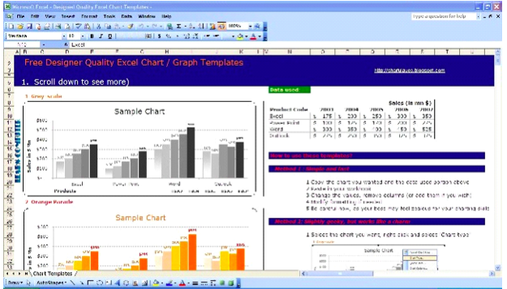

### SQL
SQL programming language used to handle and manipulate structured queries stored in relational database systems also know as RDBMS.

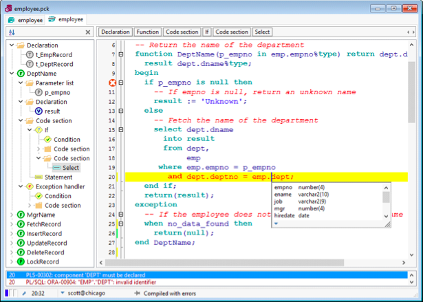

### Tableau
Tableau data visualization tool used for representing data in terms of charts and dashboards open and generate useful insights for clients. Its capability to handle relational databases, OLAP cubes, spreadsheets and also generate a number of graph types depending on the type of data retrieved. The latitude and longitudes features of a location offered in Tableau creates a geographic representation of any reports regarding sales, profit or any other factors which can be represented with the help of maps.

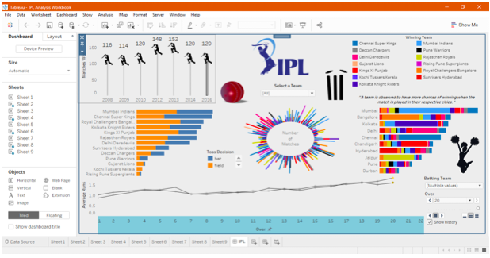

### Power BI
Power BI as a business intelligence tool developed by Microsoft. It provides interactive visualizations coupled with BI capabilities, where we build our own customized reports and dashboards, without having to depend on information technology users or database administrators. 

Its cloud-based BI services enables connecting to hundreds of data sources in the cloud, using power query to simplify data ingestion, transformation, integration, and enrichment.

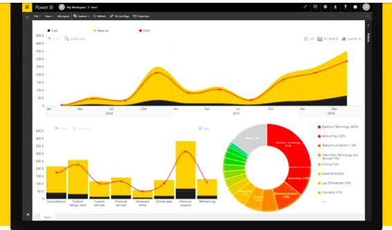

Our Problem Solving Roadmap

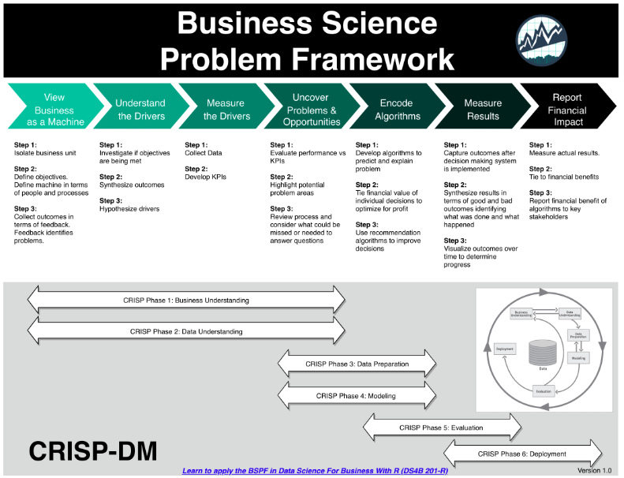

  

### License

These project are licensed under the MIT License - see the [LICENSE.md](LICENSE) file for details

 This work is licensed under a <a rel="license" href="http://creativecommons.org/licenses/by-nc-sa/4.0/">Creative Commons Attribution-NonCommercial-ShareAlike 4.0 International License</a>.
